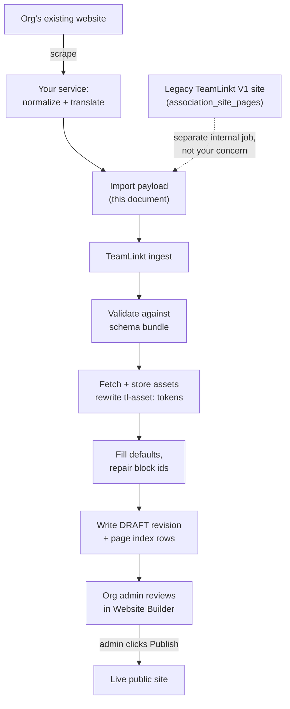

# Website Builder — Site Import Contract

**Audience:** the engineer(s) building the external scrape → normalize → Puck translation service.
**Scope:** the translation layer only — what a correct payload looks like and how to decide what
goes in it. Transport, authentication and integration are specified separately; see
[Scope](#scope).

| | |
|---|---|
| Schema bundle version | `1` |
| Blocks described | 45 |
| Blocks an importer may emit | 39 (`IntakeForm` + 5 chrome blocks are out of scope) |
| Approved templates | 6 |
| Page layouts | 8 |
| Rendered from | `core/storage/app/ai-website-builder-schema.json` |
| Generated on | 2026-08-20 |
| Validated against | 1,403 stored pages / 138 revisions of real builder data |

This document is the **complete** specification for producing TeamLinkt Website Builder content
from outside the TeamLinkt codebase. It is written to be handed to someone with no access to our
repo and no prior context. If you find yourself guessing, that is a bug in this document — say so
and it gets fixed.

> **How this document is maintained.** The block catalogue in Part III is *generated* from the
> live Puck configuration by `npm run generate:ai-website-builder-schema`, then rendered to
> markdown. It is not hand-maintained, so it cannot drift from the code by accident — but it *is*
> a point-in-time snapshot. See [Part VI](#part-vi--change-management-and-drift) for how versions
> are handed off and how drift is detected. During the PoC the schema is passed manually; there is
> deliberately no public schema endpoint yet.

---

## Table of contents

- [Part I — Orientation](#part-i--orientation)
- [Part II — The payload](#part-ii--the-payload)
- [Part III — Block catalogue](#part-iii--block-catalogue)
- [Part IV — Templates, layouts, theme and site settings](#part-iv--templates-layouts-theme-and-site-settings)
- [Part V — What happens to your payload on our side](#part-v--what-happens-to-your-payload-on-our-side)
- [Part VI — Change management and drift](#part-vi--change-management-and-drift)
- [Part VII — Worked example](#part-vii--worked-example)

---

# Part I — Orientation

## What we are building

TeamLinkt's Website Builder lets a sports organization build a public website from a palette of
pre-built blocks. The editor is [Puck](https://puckeditor.com/) — a React visual editor whose
document format is a JSON tree. A saved site is therefore a JSON document, and **anything that can
produce valid Puck JSON can produce a TeamLinkt site.**

Your service's job:

1. Scrape an organization's existing website (Tavily / Firecrawl / equivalent).
2. Normalize what you find into your own intermediate representation.
3. **Translate that into the payload described in [Part II](#part-ii--the-payload).**

Step 3 is what this document specifies. Steps 1 and 2 are entirely yours — we have no opinion on
your internal format.

### Scope

This document is about **translation**: what a correct payload looks like, and how to decide what
goes in it. It is not an integration spec. Transport, authentication, job submission, retries,
polling, rate limits, and who triggers an import are all **deliberately absent** — none of them
change the shape of a correct payload, and pinning them down before they are designed would only
date this document. They will be specified separately.

If you are wondering "how do I send this?", the answer is: not yet decided, and it does not block
you. Build the translator against the format.

## What "done" looks like

An organization's admin clicks *Import my existing site*, and a few minutes later opens the
Website Builder to find a **draft** site: their real pages, their real copy, their real images,
their brand colours, laid out in our blocks. They then fix what the machine got wrong and hit
publish themselves.

Two consequences worth internalising:

- **An import never publishes.** It writes a draft revision only. A human always reviews before
  anything is publicly visible. This means a slightly-wrong import is a nuisance, not an incident —
  optimise for coverage over caution.
- **A human is the next step, not the last resort.** You do not need to produce a perfect site. You
  need to produce a site that is faster to correct than to build from scratch.

## The pipeline



Your service owns the solid path: scrape a third-party website, normalize it, emit the payload.

The dotted path exists so you know the payload format has a second producer. Some organizations are
already on TeamLinkt's own legacy V1 site builder, and that content is in our database — we read it
directly rather than scraping it, in a separate internal job that emits **this same payload
contract** and feeds **the same ingest**. That job is not yours to build and needs nothing from you.
It is mentioned only because it is why the contract is a documented format rather than a private
handshake, and why it must stay stable. See
[Legacy V1 sites](#legacy-v1-sites-not-your-scope).

## Glossary

| Term | Meaning |
|---|---|
| **Puck** | The React visual editor whose JSON document format we store. |
| **Block** | One placeable component (`Hero`, `Text`, `Standings`). Puck calls these *components*; we say block. 45 exist. |
| **Prop** | One configurable value on a block (`heading`, `imageUrl`, `verticalPadding`). |
| **`ComponentData`** | Puck's shape for a single placed block: `{ type, props }`. |
| **`Data`** | Puck's shape for one page's content: `{ content, root, zones }`. |
| **Slot** | A prop that holds *other blocks*, enabling nesting (e.g. `Grid.column1`). |
| **Zone** | Site-level chrome shared by every page: `preHeader`, `header`, `preFooter`, `footer`. |
| **Template** | The site's chrome + theme personality (header/footer styling, fonts, colours). 6 approved. |
| **Page layout** | A pre-built starting arrangement of blocks for one page. 8 exist. |
| **Revision** | An immutable snapshot of an entire site. Saving appends one. |
| **Draft / published** | Two pointers on the site row, each naming a revision. Publishing moves a pointer. |
| **Site alias** | The org's subdomain slug. |
| **Org type** | One of six organization categories; gates which blocks are available. |
| **Association** | An organization. `association_id` is its integer primary key. |

## The hard rules

These are the constraints that, if violated, produce broken sites. Each is expanded later.

1. **Never invent a block type.** Only the 45 in Part III exist. An unknown `type` renders as a
   grey "No configuration for X" placeholder on the live site.
2. **Six of those 45 must never be emitted** — `IntakeForm` plus the five chrome blocks. See
   [Blocks you must never emit](#blocks-you-must-never-emit).
3. **Never invent a prop name.** Props are a storage contract; a typo'd prop is silently stored
   forever and the block falls back to its default. See [Part VI](#part-vi--change-management-and-drift).
4. **Never author a `resolved*` prop or `formUuid`.** These are filled by our server at render or
   save time. See [Do not author these](#do-not-author-these).
5. **Every block needs a unique `props.id`** within its page.
6. **Emit `siteSettings.zones` as empty.** Chrome comes from the template. See
   [What you may set on `site`](#what-you-may-set-on-site).
7. **Never emit a raw scraped image URL into a block prop.** Use a `tl-asset:` token and declare
   the asset. See [Assets](#assets).
8. **The homepage has an empty slug.**
9. **Slugs must be unique per site**, case-insensitively.
10. **Do not use `view` as a top-level slug** — it is a reserved route prefix.
11. **Respect org-type gating.** A `club` must not receive a `Standings` block.

---

# Part II — The payload

## What you are handed, and what you produce

**In:** a URL to scrape, and the organization's type.

**Out:** one JSON document — the payload described in this part.

| Input | Why it matters to translation |
|---|---|
| `sourceUrl` | The site to scrape. Record it back in `source.url`. |
| `orgType` | One of six values that **gates which blocks are legal** for this organization. See [Org types](#org-types). |
| `schemaVersion` | The version of this contract you mapped against. Stamp it on the payload so a version mismatch is visible before anything is ingested. |

How those inputs reach your service, how the payload comes back, authentication, retries, job
status — **all deliberately out of scope here.** None of it changes what a correct payload looks
like, and specifying it now would date this document. It gets settled separately.

## The envelope

```json
{
  "schemaVersion": 1,
  "source": {
    "url": "https://www.example-minor-hockey.ca",
    "scrapedAt": "2026-08-20T20:14:33Z",
    "pagesDiscovered": 12,
    "pagesMapped": 9
  },
  "site": { },
  "pages": [ ],
  "assets": [ ],
  "diagnostics": [ ]
}
```

| Key | Required | Meaning |
|---|---|---|
| `schemaVersion` | yes | The bundle version you mapped against. We reject a mismatch loudly. |
| `source` | yes | Provenance. Purely informational, but we log it and show counts to support. |
| `site` | yes | Branding and site-level settings. May be `{}`. |
| `pages` | yes | The pages to create. Must contain at least one page with an empty slug. |
| `assets` | yes | Every asset referenced by a `tl-asset:` token. May be `[]`. |
| `diagnostics` | yes | Things you could not map. May be `[]`. **Please use this generously.** |

### `diagnostics`

Tell us what you gave up on. This is how the contract improves — a recurring diagnostic is a
feature request for a new block.

```json
{
  "diagnostics": [
    {
      "severity": "warning",
      "code": "unmappable_section",
      "sourceUrl": "https://…/sponsors",
      "message": "Sponsor logo carousel with per-logo hyperlinks — no block supports per-item links",
      "droppedContent": "…"
    }
  ]
}
```

`severity` is `info`, `warning`, or `error`. An `error` does not mean you should abandon the
payload — emit the rest of the site and flag what broke.

## What you may set on `site`

`site` maps to our `SiteSettings` object. You may set the branding subset below and nothing else.

```json
{
  "site": {
    "siteName": "Example Minor Hockey",
    "primaryColor": "#0a3d62",
    "neutralColor": "#3f4a5b",
    "logoUrl": "tl-asset:site-logo",
    "favicon": "tl-asset:site-favicon",
    "contactEmail": "info@example-minor-hockey.ca",
    "footerCopyright": "© 2026 Example Minor Hockey Association",
    "socialLinks": {
      "facebook": "https://facebook.com/exampleminorhockey",
      "instagram": "https://instagram.com/exampleminorhockey",
      "twitter": "", "tiktok": "", "youtube": "", "linkedin": ""
    }
  }
}
```

**Allowed keys** — every one optional:

| Key | Type | Notes |
|---|---|---|
| `siteName` | string | Org's display name. |
| `logoUrl` | string | `tl-asset:` token or absolute URL. |
| `favicon` | string | `tl-asset:` token or absolute URL. |
| `primaryColor` | hex string | Brand colour. Drives buttons, links, focus rings, CTAs. |
| `neutralColor` | hex string | Primary text and borders. |
| `headerColor` | hex string | Header background. |
| `headerTextColor` | hex string | |
| `headerBackgroundImage` | string | `tl-asset:` token or `""`. |
| `siteBackground` | hex string | Outer canvas colour. |
| `siteBackgroundImage` | string | `tl-asset:` token or `""`. |
| `siteBackgroundSize` | enum | `cover` \| `contain` \| `auto` |
| `siteBackgroundPosition` | enum | `center` \| `top` \| `bottom` \| `left` \| `right` |
| `siteBackgroundRepeat` | enum | `no-repeat` \| `repeat` \| `repeat-x` \| `repeat-y` |
| `pageBackground` | hex string | Inner page surface. Usually white — keep it readable. |
| `footerCopyright` | string | |
| `contactEmail` | string | **Must be a valid address or empty.** A malformed value blocks the org from publishing. |
| `socialLinks` | object | Keys: `facebook`, `twitter`, `instagram`, `tiktok`, `youtube`, `linkedin`. Empty string = not shown. |

**Forbidden keys** — we own these; sending them is an error:

| Key | Why |
|---|---|
| `zones` | Chrome comes from the template. Send nothing, or `{"preHeader":[],"header":[],"preFooter":[],"footer":[]}`. |
| `templateId`, `templateChosen`, `templateSettings` | The org picks a template. Import leaves the default in place so the picker still offers a real choice. |
| `theme` | Radix theme overrides are template-owned. |
| `showTeamRosters` | A privacy setting. Never machine-decided. |

> **On colour extraction.** `primaryColor` and `neutralColor` are the highest-value fields in this
> whole payload. A site with the org's real colours reads as *theirs* instantly, even when the
> content needs work. Extract them from the source site's CSS or logo and get them right.

## `pages`

```json
{
  "pages": [
    {
      "id": "home",
      "slug": "",
      "title": "Home",
      "parentId": null,
      "navOrder": 0,
      "showInNav": true,
      "data": { "content": [], "root": {}, "zones": {} }
    },
    {
      "id": "p-about",
      "slug": "about",
      "title": "About Us",
      "parentId": null,
      "navOrder": 1,
      "showInNav": true,
      "data": { "content": [], "root": {}, "zones": {} }
    },
    {
      "id": "p-about-history",
      "slug": "about/history",
      "title": "Our History",
      "parentId": "p-about",
      "navOrder": 0,
      "showInNav": true,
      "data": { "content": [], "root": {}, "zones": {} }
    }
  ]
}
```

| Key | Type | Required | Notes |
|---|---|---|---|
| `id` | string | yes | **Payload-local only.** Your join key for `parentId`. Never stored — we mint a UUID per page. `"home"` is conventionally the homepage. |
| `slug` | string | yes | URL path, no leading slash. `""` = homepage. May contain `/` for nesting. |
| `title` | string | yes | Nav label and page title. |
| `parentId` | string \| null | yes | Another page's `id`, or `null` for top level. |
| `navOrder` | integer | yes | Sort order among siblings. Use distinct values — ties are broken arbitrarily. |
| `showInNav` | boolean | yes | `false` keeps the page reachable by URL but out of the menu. |
| `data` | object | yes | Puck `Data`. See [`data`](#data). |

There is one further field on our internal page model, `pageType`, which selects between a standard
page and a division-template page. **It is not importable — never send it.** Every imported page is
a standard page. Division pages expand into per-division variants and are an authoring decision an
admin makes deliberately.

`parentId` must name a page present in the same payload. A `parentId` that resolves to nothing is an
error and rejects the import — we will not silently reparent to the root.

### Slug rules

- **Exactly one page must have `slug: ""`** — the homepage. If the scrape gives you no obvious
  homepage (a site rooted at `/index.php?p=5`, a redirect chain, a one-page site), pick the page
  the site's own navigation links to most often, falling back to the shallowest URL, and set its
  slug to `""`. Do not emit a payload with no homepage and do not invent an empty one — a site
  whose landing page is blank reads as broken.
- **Slugs must be unique**, compared case-insensitively and ignoring trailing spaces. Our index is
  `utf8mb4_unicode_ci`, so `About` and `about` collide. A duplicate rejects the whole import.
- **`view` is reserved as a top-level slug.** `/view/team/{id}`, `/view/game/{id}`,
  `/view/news/{id}` and `/view/player/{id}` are entity detail routes that win over page lookup, so
  a page at `view` or `view/anything` becomes unreachable.
- Use lowercase, hyphens, no leading or trailing `/`, no file extensions. Strip `.html`, `.php`,
  `index`, and query strings from scraped URLs.
- Nest with `/` **and** set `parentId`. The slug drives the URL; `parentId` drives the menu tree.
  Keep them consistent or the nav will disagree with the address bar.

### Pages you should not create

- **Entity detail pages.** Team, game, news-article and player pages already exist at their
  reserved routes, rendered from live TeamLinkt data. Never scrape or recreate them.
- **Login, cart, account, search, admin pages.** Platform features, not content.
- **Paginated duplicates** (`/news/page/2`). Map the first page only.
- **Near-empty pages.** A page with nothing but a title is noise a human has to delete.

## `data`

Each page's `data` is a Puck `Data` object.

```json
{
  "content": [ /* ComponentData — the page's blocks, in render order */ ],
  "root": {},
  "zones": {}
}
```

| Key | What you send |
|---|---|
| `content` | The page's blocks, top to bottom. This is the whole job. |
| `root` | **Always `{}`.** Site chrome is spliced into page root props by the builder at load time; anything you put here is overwritten. |
| `zones` | **Always `{}`.** Legacy Puck nesting field. Nesting goes in slot props instead. |

## Blocks

Every block is a `ComponentData`:

```json
{
  "type": "Hero",
  "props": {
    "id": "hero-a1b2c3",
    "heading": "Welcome to Example Minor Hockey",
    "subheading": "Serving the community since 1974",
    "imageUrl": "tl-asset:home-hero"
  }
}
```

### `props.id`

Required on every block, unique within the page.

Convention is `{lowercase-type}-{6 base36 chars}` — `hero-a1b2c3`, `text-9fk2la`. Readable ids
(`hero-about-1`) are also fine. What matters is uniqueness: Puck uses `id` as its React key and
selection target, and duplicates break the editor. We re-check uniqueness on ingest and repair
collisions, but do not rely on that.

### Sparse props are correct

**Send only the props you are deliberately setting.** Every block ships a complete set of defaults
and applies them to anything you leave out. Omitting a prop is how you say "use the default" — it is
not an error, it is the intended mechanism, and it keeps your payload reviewable.

Corollaries:

- Don't echo a default back just to be explicit. Noise.
- A stored value always wins, **including an empty string.** `"heading": ""` means *deliberately
  blank*, not *absent*. If you don't have a heading, omit the key.
- Sending `null` for a prop is never correct. Omit the key instead.

### Slots and nesting

A slot prop holds an array of `ComponentData` — this is how blocks nest.

```json
{
  "type": "Grid",
  "props": {
    "id": "grid-x7k2m9",
    "columns": "3",
    "column1": [
      { "type": "Text", "props": { "id": "text-aa11bb", "body": "<p>Left</p>" } }
    ],
    "column2": [
      { "type": "Text", "props": { "id": "text-cc22dd", "body": "<p>Middle</p>" } }
    ],
    "column3": [
      { "type": "Text", "props": { "id": "text-ee33ff", "body": "<p>Right</p>" } }
    ]
  }
}
```

Blocks with slots, and where those slots live:

| Block | Slot path |
|---|---|
| `Grid` | `column1`, `column2`, `column3`, `column4` |
| `Tabs` | `tab1`, `tab2`, `tab3`, `tab4` |
| `Section` | `content` |
| `Table` | `rows[].cells[].content` — nested two array levels deep |

Nested blocks need their own unique `props.id`. Keep nesting shallow — two or three levels is
plenty, and anything past 32 levels deep is rejected as malformed.

> **`Table` deserves a closer look.** Its slot sits two array levels down, so the prop table can
> only show you `rows`. The thing to know: **a table cell holds blocks, not a string.** Every cell
> is `{ "content": [ …blocks… ] }`, so a text cell means a `Text` block inside it:
>
> ```json
> {
>   "type": "Table",
>   "props": {
>     "id": "table-k9m2p4",
>     "hasHeaderRow": true,
>     "rows": [
>       { "cells": [
>         { "content": [ { "type": "Text", "props": { "id": "text-h1", "body": "Division" } } ] },
>         { "content": [ { "type": "Text", "props": { "id": "text-h2", "body": "Fee" } } ] }
>       ] },
>       { "cells": [
>         { "content": [ { "type": "Text", "props": { "id": "text-r1c1", "body": "U11" } } ] },
>         { "content": [ { "type": "Text", "props": { "id": "text-r1c2", "body": "$450" } } ] }
>       ] }
>     ]
>   }
> }
> ```
>
> Every row must have the same number of cells. `hasHeaderRow: true` styles the first row as a
> header. Given the verbosity, prefer `Table` only where the data really is tabular — a two-column
> list is usually better as `TwoColumn` or a `Grid`.

### Rich text

**Exactly five props accept HTML.** Every other string prop is plain text — HTML sent anywhere else
is displayed literally, tags and all.

| Block | Prop |
|---|---|
| `Text` | `body` |
| `TwoColumn` | `leftBody`, `rightBody` |
| `Accordion` | `items[].body` |
| `FAQ` | `items[].body` |

The value is an HTML string, and the public renderer injects it as HTML. The editor behind these
props is Puck's richtext field, built on TipTap, with its full default extension set enabled. That
extension set defines the supported vocabulary:

| Markup | Produces |
|---|---|
| `<p>` | Paragraph |
| `<h1>`–`<h6>` | Headings |
| `<strong>` `<em>` `<u>` `<s>` | Bold, italic, underline, strikethrough |
| `<ul>` `<ol>` `<li>` | Bullet and ordered lists |
| `<blockquote>` | Block quote |
| `<a href>` | Link |
| `<code>` `<pre>` | Inline code, code block |
| `<hr>` `<br>` | Horizontal rule, line break |
| `style="text-align: …"` on a block element | Text alignment |

> **Unsupported markup is a trap, not an error.** Send a `<table>` and it *will* render on the
> published site, because the renderer injects your stored HTML verbatim. But the first time a
> human opens that field in the editor, TipTap parses the HTML into its own schema and **silently
> drops every node it does not recognise.** The content looks fine until someone edits it, then
> disappears. So `<table>`, `<div>`, `<span>`, ``, `<iframe>`, `<form>`, `<script>`, `class=`,
> `id=`, event handlers and other inline styles must never be sent — not because they fail loudly,
> but because they fail quietly and later.

Rules:

- Convert scraped markup **down** to the supported vocabulary; never pass through raw scraped HTML.
- **Images cannot live inside rich text.** A picture in a scraped paragraph becomes a separate
  `Image` block plus an `assets[]` entry.
- **Prefer a real prop over markup.** A scraped `<h1>` belongs in the block's `heading` prop, not
  as `<h1>` inside a richtext body. For a standalone heading, use a `Text` block with
  `as: "h2"` and plain body text rather than wrapping the text in `<h2>` tags — `Text.as` accepts
  `p`, `h1`, `h2`, `h3` and produces properly styled output.
- One `h1` per page belongs to the page; blocks own their own heading hierarchy below that.
- Anchors must be absolute (`https://…`) or root-relative (`/about`). Never relative to the
  scraped site's path structure.
- Strip tracking parameters and `mailto:` obfuscation.
- Layout done with `<table>` or nested `<div>`s must be discarded and re-expressed with `Grid`,
  `TwoColumn`, or separate blocks.

### Blocks you must never emit

Six of the 45 are documented for completeness but are **out of scope for an import payload.** They
are flagged 🛑 in Part III.

| Block | Why |
|---|---|
| `IntakeForm` | Its questions provision a real form record on save. Organizations build these by hand — see [Forms](#forms). |
| `NavMenu` | Zone-only. Zones are template-owned. |
| `SiteNotice` | Zone-only. Zones are template-owned. |
| `FooterColumns` | Zone-only. Zones are template-owned. |
| `FooterLogo` | Zone-only. Zones are template-owned. |
| `FooterSocial` | Zone-only. Zones are template-owned. |

That leaves **39 emittable blocks.**

### Do not author these

Some props exist in storage but are produced by our server. **Never emit them.** They are marked
🚫 in Part III.

| Block | Prop | Owner |
|---|---|---|
| `NewsList`, `NewsRotator` | `resolvedItems` | Render-time. |
| `Sponsors` | `resolvedSponsors` | Render-time. |
| `Fundraisers` | `resolvedFundraisers` | Render-time. |

Rule of thumb: **any prop beginning with `resolved`, plus `formUuid`.**

Two blocks carry server-owned props that you will never encounter, because the blocks themselves
are out of scope: `NavMenu.resolvedRegistrationUrl`, and `IntakeForm`'s `formUuid` +
`resolvedQuestions` / `resolvedRequireName` / `resolvedRequireEmail` / `resolvedError`.

## Assets

Blocks store image and file references as plain URL strings. Since you cannot know the final URL —
we host the file after you hand it over — you emit a **token** and declare the asset separately.

### Token format

```
tl-asset:<ref>
```

`<ref>` is your own identifier: `[a-z0-9-]{1,64}`, unique within the payload. Any prop that takes
an asset URL accepts a token: block props like `Hero.imageUrl`, and `site` keys like `logoUrl`.

### Declaring assets

```json
{
  "assets": [
    {
      "ref": "home-hero",
      "sourceUrl": "https://www.example-minor-hockey.ca/img/rink-banner.jpg",
      "filename": "rink-banner.jpg",
      "mimeType": "image/jpeg",
      "alt": "Players on the ice at the community rink",
      "usage": "hero"
    },
    {
      "ref": "site-logo",
      "sourceUrl": "https://www.example-minor-hockey.ca/img/logo.png",
      "filename": "logo.png",
      "mimeType": "image/png",
      "usage": "logo"
    }
  ]
}
```

| Key | Required | Notes |
|---|---|---|
| `ref` | yes | Matches the `tl-asset:` token. |
| `sourceUrl` | yes | Absolute, publicly fetchable, no auth. We fetch it server-side. |
| `filename` | yes | Original name, used for the asset library listing. |
| `mimeType` | yes | Must match what the URL actually serves. |
| `alt` | no | Alt text if you have it. Strongly encouraged. |
| `usage` | no | Hint: `logo`, `favicon`, `hero`, `gallery`, `document`, `other`. |

### Accepted types

| | |
|---|---|
| Images | `image/jpeg`, `image/png`, `image/webp`, `image/gif` |
| Documents | `application/pdf` |

**SVG is not accepted.** An SVG is a script-capable document, and the file would end up stored by us
and served from the organization's own domain — that is a stored-XSS vector, not a picture. Scraped
logos are often SVG, so this will come up: **rasterize to PNG** at a generous size (at least 512px
on the long edge, transparent background preserved) and declare that instead.

Anything outside this list should be left out and noted as a `warning` diagnostic rather than
declared and rejected. `mimeType` must match what the URL actually serves — it is verified, not
trusted.

Keep the asset set proportionate: a club website is tens of images, not thousands. A payload
declaring hundreds of assets usually means decorative chrome is being swept up (see the last rule
below).

### How a token becomes a URL

Each declared asset is fetched from its `sourceUrl`, stored against the organization, registered in
its asset library, and every `tl-asset:<ref>` occurrence is rewritten to the stored URL.

**A failed asset does not fail the import.** If a fetch fails, that one token falls back to a
placeholder and a diagnostic is recorded; the rest of the site still lands. A dead image on a
crumbling source site costs one image, not the run.

Rules:

- **Every token must have a matching `assets[]` entry.** An unresolvable token is a broken image.
- **Every declared asset should be referenced.** Unreferenced assets are uploaded and orphaned.
- **Deduplicate by source URL.** One `ref` per distinct file, reused across as many props as needed.
- **Absolute URLs are permitted but discouraged.** If you emit a bare `https://…` into a prop it
  will render — and the org's new site will hotlink the site they are replacing, breaking when it
  goes away. Use tokens.
- **Skip decorative chrome.** Spacers, bullets, gradient strips, social icons: our blocks supply
  their own. Import content images, not theme furniture.

## Org types

`orgType` gates which blocks an organization may receive. It is supplied to you as an input; respect
it.

| Value | |
|---|---|
| `club` | Single club |
| `association` | Association |
| `league` | League |
| `high_school` | High school |
| `civic` | Civic organization |
| `multi_location` | Multi-location organization |

Blocks with an **Org types** row in Part III listing anything other than "all" are restricted.
Concretely:

- `Standings`, `Scores`, `Schedule`, `ScoresSchedule`, `Statistics`, `Suspensions`, `TeamRoster`,
  `Teams` → only `league`, `high_school`, `association`.
- `EventMarquee` → those three plus `club`.
- Everything else → all six.

Emitting a restricted block for the wrong org type is an error, not a warning: the block would not
even appear in that org's palette.

## Legacy V1 sites: not your scope

Some organizations are on TeamLinkt's own legacy V1 site builder rather than a third-party
platform. **These are out of scope for your service**, for a simple reason: their content is in our
database, so scraping it would be a lossy way to read data we already own. That migration is a
separate internal job.

You will not be asked to handle them. If you are given a `sourceUrl` that turns out to be a
TeamLinkt-hosted V1 site, scrape it like any other site — do not special-case it. We will not
knowingly send you one.

The only thing worth knowing: that internal job emits **this same payload contract** and runs
through the same ingest. So the format has two producers, which is why it is versioned and why
the rules here are stated as a contract rather than a convention.

---
# Part III — Block catalogue

All 45 blocks, generated from the live Puck configuration. Grouped by the same categories the
block palette shows an admin.

## How to read an entry

Each block gets a table of props with four columns:

| Column | Meaning |
|---|---|
| **Prop** | The exact key to use in `props`. Case-sensitive. |
| **Type** | `string`, `number`, `boolean`, `enum`, `array`, `object`, `richtext`, `slot`, `opaque`. |
| **Allowed / notes** | Enum values, numeric range, or the keys of a nested object / array item. |
| **Default** | What the block ships. Omit the prop to get this. |

Plus a collapsible **Complete `defaults`** block with the block's entire default set verbatim —
useful for nested shapes the table can only summarise.

### Reading the type column

- **`enum`** — send exactly one of the listed values. Values are shown JSON-quoted, so
  `` `false` `` is the boolean and `` `"2"` `` is the string.
- **`number`** — send a JSON number. Ranges are **editor slider bounds, not validation** — they are
  not enforced on save — but stay inside them.
- **`array`** — a JSON array. When the entries are objects, their keys are listed and expanded in a
  sub-table beneath.
- **`object`** — a structured value. Its keys are listed and expanded in a sub-table beneath.
- **`richtext`** — the HTML subset from [Rich text](#rich-text).
- **`slot`** — an array of `ComponentData`. See [Slots and nesting](#slots-and-nesting).
- **`string`** — plain text. When the label mentions colour, it is a hex string or `""`.
- **`opaque`** — rare, and means what it says: the schema cannot describe the shape. Read the
  **Default** column, or omit the prop.

### The two markers

- **🛑** — on a block heading: **never emit this block.** Six are out of scope. See
  [Blocks you must never emit](#blocks-you-must-never-emit).
- **🚫** — on a prop: server-owned, never emit. See [Do not author these](#do-not-author-these).

### Three things about the Default column

**Every prop is optional.** Each block's `required` list is empty, and deliberately so: Puck applies
a block's defaults when it is inserted, so a prop that ships with a default is never genuinely
required. Send sparse props — see [Sparse props are correct](#sparse-props-are-correct).

**Stock-media defaults are environment-resolved.** A few blocks default to TeamLinkt-hosted stock
imagery, which appears here as a root-relative path like `/photos/football-banner.jpg`. The real base
URL is injected per environment at runtime, so these are placeholders, not addresses. Never copy one
into a prop. Omitting the prop is the correct way to take the default, and it resolves properly when
the page renders.

**Three props are stored but have no editor field.** `Hero.visibility`, `NewsList.resolvedItems` and
`NewsRotator.resolvedItems` appear in the stored prop set with no field behind them, listed as "no
editor field — stored only". The two `resolvedItems` are 🚫. `Hero.visibility` you may set — it is
`{ showPreheading, showHeading, showSubheading }`, all booleans — but omitting it is fine.

### How much to trust this catalogue

It is generated, and as of this version it is **internally consistent**: every prop's declared type
matches the value the block actually ships, every enum default is a member of its own enum, and
every numeric default sits inside its declared range. Zero discrepancies across all 45 blocks and
612 props.

So there is no list of exceptions to work around, and you should not need to second-guess a type. If
you do find a prop whose documented type contradicts its default, that is a bug worth reporting —
not a known quirk to code around.

## Choosing a block: mapping guidance

**This section is advisory, not normative.** The tables above are the contract; what follows is our
opinion on which block fits which scraped content. Use your judgement — you will see patterns we
have not.

| What you scraped | Use | Notes |
|---|---|---|
| Big banner, headline over an image | `Hero` | `layout: "overlay"` is the default and safest. Use `split` when there is substantial copy beside the image. |
| Body copy, paragraphs, article text | `Text` | The workhorse. Prefer several `Text` blocks over one giant one — easier for a human to rearrange. |
| Standalone image | `Image` | |
| Image grid, photo page | `Gallery` | For a static set of scraped photos. |
| "Our programs", 3–6 feature cards with icons | `FeatureGrid` | |
| Numbers: "500 players, 40 teams, 12 rinks" | `StatsCounter` | High-impact and easy to extract. |
| Quotes from parents/players | `Testimonials` | |
| Expandable Q&A | `Accordion` or `FAQ` | `FAQ` for a dedicated FAQ page; `Accordion` for expandable sections inside another page. |
| Board / staff / coach list with photos | `TeamMembers` | Static scraped people. **Not** `Executives` — that pulls live TeamLinkt data. |
| Registration / signup prompt | `CTABanner` | |
| A link styled as a button | `Button` | |
| Embedded YouTube/Vimeo | `Video` | |
| PDF links (forms, codes of conduct) | `FileDownload` | Declare each PDF in `assets[]`. |
| Contact page with a form | `ContactForm` | Fixed fields: name, email, subject, message, phone. `showSubject` / `showPhone` toggle the last two. Set `contactEmail` to the destination address. |
| Tabular data that isn't sports data | `Table` | Fee schedules, equipment lists. |
| Two-column layout | `TwoColumn` or `Grid` | `TwoColumn` for text/media pairs; `Grid` for 3–4 equal columns. |
| Visually distinct band/section | `Section` | Wrap blocks to give them a shared background. |
| Vertical breathing room | `Spacer` | Use sparingly; blocks have their own padding. |
| Tabbed content | `Tabs` | |
| Rotating banner/carousel | `Slider` | |

### Blocks to place but never populate — the TeamLinkt Widgets

Sixteen blocks render **live TeamLinkt data**: standings, schedules, scores, rosters, statistics,
suspensions, teams, locations, news, sponsors, executives, fundraisers, events, sub-organizations.

Their props are *configuration* — how many items, which layout, which division filter — never
content. They fetch their own data at render time. This has a specific consequence:

> **You may place a widget. You may not fill it.** Emit the block with default props (plus layout
> props if you have an opinion) and nothing else. Never scrape a standings table off the old site
> and try to feed it in — there is nowhere to put it, and the block will show live data regardless.

Place them where the source site clearly had that function:

| Scraped page | Widget | Org types |
|---|---|---|
| Standings table | `Standings` | league, high_school, association |
| Schedule of games | `Schedule` or `ScoresSchedule` | league, high_school, association |
| Recent results | `Scores` | league, high_school, association |
| Team list / "our teams" | `Teams` | league, high_school, association |
| Roster page | `TeamRoster` | league, high_school, association |
| Player stats / leaders | `Statistics` | league, high_school, association |
| Suspensions | `Suspensions` | league, high_school, association |
| Upcoming events strip | `EventMarquee` | + club |
| News / announcements | `NewsList` or `NewsRotator` | all |
| Rinks / fields / venues | `Locations` | all |
| Sponsor logos | `Sponsors` | all |
| Board of directors (live) | `Executives` | all |
| Fundraising campaigns | `Fundraisers` | all |
| Member clubs / divisions | `SubOrganizations` | all |

A widget with no data yet renders an empty state, which is correct and self-explanatory — better
than a page that silently lost a section. But do not place one speculatively: only where the source
site actually had that function.

### Forms

There is exactly one importable form block.

- **`ContactForm`** — safe to place freely. Fixed field set, posts to the organization's own
  contact endpoint. Nothing is provisioned; there is no backing record and no `formUuid`. Use it
  for any scraped "contact us" form.
- **`IntakeForm`** — **out of scope. Never emit it.** Its configured questions provision a real
  form record on save, and a machine-invented registration form is a support burden that pollutes
  the org's form list. Organizations create these by hand in the builder.

So: a scraped contact form becomes a `ContactForm`. **Every other form** — registration, volunteer
signup, tryout application, custom questionnaire — becomes a **diagnostic**, not a block:

```json
{
  "severity": "info",
  "code": "form_not_imported",
  "sourceUrl": "https://…/registration",
  "message": "Registration form collected: player name, birthdate, division, parent email, emergency contact. Not imported — org should build this in the form builder."
}
```

Recording what the original form collected is genuinely useful: it gives the admin a checklist to
rebuild from. Silently dropping the form does not.

Because `IntakeForm` is out of scope, **`formUuid` never appears in a valid payload** — but the
prohibition stands regardless.

### Chrome blocks

`NavMenu`, `SiteNotice`, `FooterColumns`, `FooterLogo`, `FooterSocial` live **only** in site zones,
never in page content — and you do not author zones. They are documented for completeness; you
should not emit them at all. The template supplies them.

---

## The catalogue

Generated from schema bundle version `1`. Categories below match the block palette's own grouping.

### Layout

#### `CTABanner`

Banner with eyebrow, headline, body and a call-to-action button.

**Zones:** page content only · **Org types:** all

| Prop | Type | Allowed / notes | Default |
|---|---|---|---|
| `preheading` | string | — | `""` |
| `heading` | string | — | `"Ready when you are."` |
| `body` | string | — | `"Join the season — registration is open now."` |
| `ctaLabel` | string | — | `"Register"` |
| `ctaHref` | string | — | `"#"` |
| `alignment` | enum | `"left"` `"center"` `"right"` | `"center"` |
| `background` | enum | `"transparent"` `"subtle"` `"accent"` `"inverse"` | `"accent"` |
| `horizontalPadding` | number | min 16, max 160 | `24` |
| `verticalPadding` | number | min 16, max 160 | `72` |

<details>
<summary>Complete <code>defaults</code> for <code>CTABanner</code></summary>

```json
{
  "preheading": "",
  "heading": "Ready when you are.",
  "body": "Join the season — registration is open now.",
  "ctaLabel": "Register",
  "ctaHref": "#",
  "alignment": "center",
  "background": "accent",
  "horizontalPadding": 24,
  "verticalPadding": 72
}
```

</details>

#### `Grid`

2–4 column layout with drop zones for nested blocks.

**Zones:** page content only · **Org types:** all · **Slots:** `column1`, `column2`, `column3`, `column4`

| Prop | Type | Allowed / notes | Default |
|---|---|---|---|
| `columns` | enum | `"2"` `"3"` `"4"` | `"3"` |
| `columnWeights` | string | — | `""` |
| `gap` | number | min 0, max 96 | `24` |
| `background` | string | — | `"transparent"` |
| `backgroundImage` | string | — | `""` |
| `backgroundOpacity` | number | min 0, max 100 | `100` |
| `column1` | slot | `ComponentData[]` | `[]` |
| `column1Align` | enum | `"stretch"` `"left"` `"center"` `"right"` | `"stretch"` |
| `column2` | slot | `ComponentData[]` | `[]` |
| `column2Align` | enum | `"stretch"` `"left"` `"center"` `"right"` | `"stretch"` |
| `column3` | slot | `ComponentData[]` | `[]` |
| `column3Align` | enum | `"stretch"` `"left"` `"center"` `"right"` | `"stretch"` |
| `column4` | slot | `ComponentData[]` | `[]` |
| `column4Align` | enum | `"stretch"` `"left"` `"center"` `"right"` | `"stretch"` |
| `maxWidth` | number | min 480, max 1920 | `1920` |
| `horizontalPadding` | number | min 0, max 120 | `24` |
| `verticalPadding` | number | min 0, max 120 | `48` |

<details>
<summary>Complete <code>defaults</code> for <code>Grid</code></summary>

```json
{
  "columns": "3",
  "columnWeights": "",
  "gap": 24,
  "background": "transparent",
  "backgroundImage": "",
  "backgroundOpacity": 100,
  "column1": [],
  "column1Align": "stretch",
  "column2": [],
  "column2Align": "stretch",
  "column3": [],
  "column3Align": "stretch",
  "column4": [],
  "column4Align": "stretch",
  "maxWidth": 1920,
  "horizontalPadding": 24,
  "verticalPadding": 48
}
```

</details>

#### `Hero`

Full-width banner with image, headline and CTA.

**Zones:** page content only · **Org types:** all

| Prop | Type | Allowed / notes | Default |
|---|---|---|---|
| `layout` | enum | `"overlay"` `"split"` `"text"` `"image"` | `"overlay"` |
| `imageUrl` | string | — | `"/photos/football-banner.jpg"` |
| `height` | number | min 200, max 900 | `480` |
| `primaryButton` | object | keys: `label`, `href` | `{"label":"Call to action","href":""}` |
| `secondaryButton` | object | keys: `label`, `href` | `{"label":"Secondary action","href":""}` |
| `contentAlignment` | enum | `"left"` `"center"` `"right"` | `"center"` |
| `preheading` | string | — | `""` |
| `heading` | string | — | `""` |
| `subheading` | string | — | `""` |
| `preheadingColor` | string | — | `""` |
| `headingColor` | string | — | `""` |
| `subheadingColor` | string | — | `""` |
| `alignment` | enum | `"left"` `"center"` `"right"` | `"center"` |
| `background` | enum | `"transparent"` `"subtle"` `"accent"` `"inverse"` | `"transparent"` |
| `maxWidth` | number | min 480, max 1920 | `1920` |
| `horizontalPadding` | number | min 0, max 120 | `0` |
| `verticalPadding` | number | min 0, max 120 | `0` |
| `visibility` | object | no editor field — stored only | `{"showPreheading":true,"showHeading":true,"showSubheading":true}` |

`primaryButton` shape:

| Key | Type | Allowed / notes |
|---|---|---|
| `label` | string | — |
| `href` | string | — |

`secondaryButton` shape:

| Key | Type | Allowed / notes |
|---|---|---|
| `label` | string | — |
| `href` | string | — |

<details>
<summary>Complete <code>defaults</code> for <code>Hero</code></summary>

```json
{
  "layout": "overlay",
  "imageUrl": "/photos/football-banner.jpg",
  "primaryButton": {
    "label": "Call to action",
    "href": ""
  },
  "secondaryButton": {
    "label": "Secondary action",
    "href": ""
  },
  "height": 480,
  "contentAlignment": "center",
  "visibility": {
    "showPreheading": true,
    "showHeading": true,
    "showSubheading": true
  },
  "preheading": "",
  "heading": "",
  "subheading": "",
  "preheadingColor": "",
  "headingColor": "",
  "subheadingColor": "",
  "alignment": "center",
  "background": "transparent",
  "maxWidth": 1920,
  "horizontalPadding": 0,
  "verticalPadding": 0
}
```

</details>

#### `Section`

Full-width band with background, padding and a content slot.

**Zones:** page content only · **Org types:** all · **Slots:** `content`

| Prop | Type | Allowed / notes | Default |
|---|---|---|---|
| `background` | string | — | `"var(--color-panel-solid)"` |
| `backgroundImage` | string | — | `""` |
| `overlay` | string | — | `"rgba(0,0,0,0)"` |
| `paddingTop` | number | min 0, max 240 | `72` |
| `paddingBottom` | number | min 0, max 240 | `72` |
| `horizontalPadding` | number | min 0, max 96 | `24` |
| `maxWidth` | enum | `"full"` `720` `960` `1120` `1280` `1440` | `1120` |
| `align` | enum | `"left"` `"center"` `"right"` | `"center"` |
| `textColor` | string | — | `"inherit"` |
| `content` | slot | `ComponentData[]` | `[]` |

<details>
<summary>Complete <code>defaults</code> for <code>Section</code></summary>

```json
{
  "background": "var(--color-panel-solid)",
  "backgroundImage": "",
  "overlay": "rgba(0,0,0,0)",
  "paddingTop": 72,
  "paddingBottom": 72,
  "maxWidth": 1120,
  "align": "center",
  "textColor": "inherit",
  "horizontalPadding": 24,
  "content": []
}
```

</details>

#### `Spacer`

Vertical breathing room between blocks.

**Zones:** page content only · **Org types:** all

| Prop | Type | Allowed / notes | Default |
|---|---|---|---|
| `size` | number | min 4, max 200 | `32` |
| `color` | string | — | `"transparent"` |

<details>
<summary>Complete <code>defaults</code> for <code>Spacer</code></summary>

```json
{
  "size": 32,
  "color": "transparent"
}
```

</details>

#### `Table`

Grid of droppable cells — arrange blocks in rows and columns, with an optional header row.

**Zones:** page content only · **Org types:** all · **Slots:** `rows[].cells[].content`

| Prop | Type | Allowed / notes | Default |
|---|---|---|---|
| `rows` | array | items: `cells` | `[{"cells":[{"content":[]},{"content":[]},{"content":[]}]},{"cells":[{"content":[]},{"co…` |
| `hasHeaderRow` | enum | `true` `false` | `true` |
| `variant` | enum | `"surface"` `"ghost"` | `"surface"` |
| `size` | enum | `"1"` `"2"` `"3"` | `"2"` |
| `maxWidth` | number | min 480, max 1920 | `1920` |
| `horizontalPadding` | number | min 0, max 120 | `24` |
| `verticalPadding` | number | min 0, max 120 | `48` |

`rows[]` shape:

| Key | Type | Allowed / notes |
|---|---|---|
| `cells` | array | items: `content` |

<details>
<summary>Complete <code>defaults</code> for <code>Table</code></summary>

```json
{
  "rows": [
    {
      "cells": [
        {
          "content": []
        },
        {
          "content": []
        },
        {
          "content": []
        }
      ]
    },
    {
      "cells": [
        {
          "content": []
        },
        {
          "content": []
        },
        {
          "content": []
        }
      ]
    }
  ],
  "hasHeaderRow": true,
  "variant": "surface",
  "size": "2",
  "maxWidth": 1920,
  "horizontalPadding": 24,
  "verticalPadding": 48
}
```

</details>

#### `Tabs`

Up to 4 named tabs, each with its own block slot. Swap between Highlights / Schedule / Standings views, or any content sets.

**Zones:** page content only · **Org types:** all · **Slots:** `tab1`, `tab2`, `tab3`, `tab4`

| Prop | Type | Allowed / notes | Default |
|---|---|---|---|
| `tab1Label` | string | — | `"Highlights"` |
| `tab1` | slot | `ComponentData[]` | `[]` |
| `tab2Label` | string | — | `"Schedule"` |
| `tab2` | slot | `ComponentData[]` | `[]` |
| `tab3Label` | string | — | `"Standings"` |
| `tab3` | slot | `ComponentData[]` | `[]` |
| `tab4Label` | string | — | `""` |
| `tab4` | slot | `ComponentData[]` | `[]` |
| `tabStyle` | enum | `"underline"` `"pills"` `"segmented"` | `"underline"` |
| `background` | enum | `"transparent"` `"subtle"` `"accent"` `"inverse"` | `"transparent"` |
| `textColor` | string | — | `""` |
| `maxWidth` | number | min 480, max 1920 | `1920` |
| `horizontalPadding` | number | min 0, max 120 | `24` |
| `verticalPadding` | number | min 0, max 120 | `48` |

<details>
<summary>Complete <code>defaults</code> for <code>Tabs</code></summary>

```json
{
  "tab1Label": "Highlights",
  "tab1": [],
  "tab2Label": "Schedule",
  "tab2": [],
  "tab3Label": "Standings",
  "tab3": [],
  "tab4Label": "",
  "tab4": [],
  "tabStyle": "underline",
  "background": "transparent",
  "textColor": "",
  "maxWidth": 1920,
  "horizontalPadding": 24,
  "verticalPadding": 48
}
```

</details>

#### `TwoColumn`

Side-by-side heading + body pair.

**Zones:** page content only · **Org types:** all

| Prop | Type | Allowed / notes | Default |
|---|---|---|---|
| `leftHeading` | string | — | `"Heading"` |
| `leftHeadingColor` | string | — | `"var(--gray-12)"` |
| `leftBody` | richtext | HTML subset | `"Paragraph text."` |
| `leftBodyColor` | string | — | `"var(--gray-11)"` |
| `rightHeading` | string | — | `"Heading"` |
| `rightHeadingColor` | string | — | `"var(--gray-12)"` |
| `rightBody` | richtext | HTML subset | `"Paragraph text."` |
| `rightBodyColor` | string | — | `"var(--gray-11)"` |
| `background` | string | — | `"transparent"` |
| `backgroundImage` | string | — | `""` |
| `backgroundOpacity` | number | min 0, max 100 | `100` |

<details>
<summary>Complete <code>defaults</code> for <code>TwoColumn</code></summary>

```json
{
  "leftHeading": "Heading",
  "leftHeadingColor": "var(--gray-12)",
  "leftBody": "Paragraph text.",
  "leftBodyColor": "var(--gray-11)",
  "rightHeading": "Heading",
  "rightHeadingColor": "var(--gray-12)",
  "rightBody": "Paragraph text.",
  "rightBodyColor": "var(--gray-11)",
  "background": "transparent",
  "backgroundImage": "",
  "backgroundOpacity": 100
}
```

</details>

### Content

#### `Button`

Call-to-action link with label and URL.

**Zones:** page content only · **Org types:** all

| Prop | Type | Allowed / notes | Default |
|---|---|---|---|
| `label` | string | — | `"Button"` |
| `href` | string | — | `"#"` |
| `variant` | enum | `"solid"` `"soft"` `"outline"` `"ghost"` | `"solid"` |
| `size` | enum | `"1"` `"2"` `"3"` `"4"` | `"3"` |
| `alignment` | enum | `"left"` `"center"` `"right"` | `"left"` |
| `textColor` | string | — | `""` |
| `backgroundColor` | string | — | `""` |
| `maxWidth` | number | min 480, max 1920 | `1920` |
| `horizontalPadding` | number | min 0, max 120 | `24` |
| `verticalPadding` | number | min 0, max 120 | `48` |

<details>
<summary>Complete <code>defaults</code> for <code>Button</code></summary>

```json
{
  "label": "Button",
  "href": "#",
  "variant": "solid",
  "size": "3",
  "alignment": "left",
  "textColor": "",
  "backgroundColor": "",
  "maxWidth": 1920,
  "horizontalPadding": 24,
  "verticalPadding": 48
}
```

</details>

#### `FAQ`

Frequently asked questions — eyebrow + headline + Q/A list with single-open behaviour by default.

**Zones:** page content only · **Org types:** all

| Prop | Type | Allowed / notes | Default |
|---|---|---|---|
| `items` | array | items: `title`, `body`, `titleColor`, `bodyColor`, `defaultOpen` | `[{"title":"When does the season start?","body":"Fall registration opens August 1; the s…` |
| `mode` | enum | `"single"` `"multi"` | `"multi"` |
| `maxWidth` | number | min 480, max 1920 | `1920` |
| `verticalPadding` | number | min 0, max 120 | `48` |
| `horizontalPadding` | number | min 0, max 120 | `24` |
| `surface` | enum | `"transparent"` `"subtle"` `"accent"` `"inverse"` | `"transparent"` |
| `colorOptions` | object | keys: `background`, `divider`, `questions`, `body`, `heading`, `preheading` | `{"background":"","divider":"var(--gray-6)","questions":"","body":"","heading":"","prehe…` |
| `preheading` | string | — | `""` |
| `heading` | string | — | `"Frequently asked questions"` |
| `subheading` | string | — | `""` |
| `preheadingColor` | string | — | `"#000000"` |
| `headingColor` | string | — | `"#1c2024"` |
| `subheadingColor` | string | — | `"#60646c"` |
| `alignment` | enum | `"left"` `"center"` `"right"` | `"center"` |
| `background` | enum | `"transparent"` `"subtle"` `"accent"` `"inverse"` | `"transparent"` |

`items[]` shape:

| Key | Type | Allowed / notes |
|---|---|---|
| `title` | string | — |
| `body` | richtext | HTML subset |
| `titleColor` | string | — |
| `bodyColor` | string | — |
| `defaultOpen` | enum | `false` `true` |

`colorOptions` shape:

| Key | Type | Allowed / notes |
|---|---|---|
| `background` | string | — |
| `divider` | string | — |
| `questions` | string | — |
| `body` | string | — |
| `heading` | string | — |
| `preheading` | string | — |

<details>
<summary>Complete <code>defaults</code> for <code>FAQ</code></summary>

```json
{
  "preheading": "",
  "heading": "Frequently asked questions",
  "subheading": "",
  "preheadingColor": "#000000",
  "headingColor": "#1c2024",
  "subheadingColor": "#60646c",
  "alignment": "center",
  "background": "transparent",
  "maxWidth": 1920,
  "horizontalPadding": 24,
  "verticalPadding": 48,
  "items": [
    {
      "title": "When does the season start?",
      "body": "Fall registration opens August 1; the season runs September through November. Spring registration opens in January.",
      "titleColor": "",
      "bodyColor": "",
      "defaultOpen": false
    },
    {
      "title": "How do I register a player?",
      "body": "Visit the Registration page, pick the program your athlete qualifies for, and follow the prompts. Payment is collected at the end.",
      "titleColor": "",
      "bodyColor": "",
      "defaultOpen": false
    },
    {
      "title": "What if my child has never played before?",
      "body": "We run a \"new to the sport\" track at every age group with coaches who specialize in fundamentals. Mention it on the registration form.",
      "titleColor": "",
      "bodyColor": "",
      "defaultOpen": false
    },
    {
      "title": "Are scholarships available?",
      "body": "Yes — financial aid is available on a needs basis. Contact the board through the form on this site.",
      "titleColor": "",
      "bodyColor": "",
      "defaultOpen": false
    }
  ],
  "mode": "multi",
  "surface": "transparent",
  "colorOptions": {
    "background": "",
    "divider": "var(--gray-6)",
    "questions": "",
    "body": "",
    "heading": "",
    "preheading": ""
  }
}
```

</details>

#### `FeatureGrid`

Repeating icon + title + body cells in a 2/3/4-column grid.

**Zones:** page content only · **Org types:** all

| Prop | Type | Allowed / notes | Default |
|---|---|---|---|
| `columns` | enum | `2` `3` `4` | `3` |
| `items` | array | items: `icon`, `title`, `body` | `[{"icon":"🏆","title":"Season standings","body":"Live tables across every division, upd…` |
| `featureTitleColor` | string | — | `"var(--gray-12)"` |
| `featureBodyColor` | string | — | `"var(--gray-11)"` |
| `preheading` | string | — | `""` |
| `heading` | string | — | `"What you get"` |
| `subheading` | string | — | `""` |
| `preheadingColor` | string | — | `"#000000"` |
| `headingColor` | string | — | `"#1c2024"` |
| `subheadingColor` | string | — | `"#60646c"` |
| `alignment` | enum | `"left"` `"center"` `"right"` | `"center"` |
| `background` | enum | `"transparent"` `"subtle"` `"accent"` `"inverse"` | `"transparent"` |
| `maxWidth` | number | min 480, max 1920 | `1920` |
| `horizontalPadding` | number | min 0, max 120 | `24` |
| `verticalPadding` | number | min 0, max 120 | `48` |

`items[]` shape:

| Key | Type | Allowed / notes |
|---|---|---|
| `icon` | string | — |
| `title` | string | — |
| `body` | string | — |

<details>
<summary>Complete <code>defaults</code> for <code>FeatureGrid</code></summary>

```json
{
  "preheading": "",
  "heading": "What you get",
  "subheading": "",
  "preheadingColor": "#000000",
  "headingColor": "#1c2024",
  "subheadingColor": "#60646c",
  "alignment": "center",
  "background": "transparent",
  "maxWidth": 1920,
  "horizontalPadding": 24,
  "verticalPadding": 48,
  "columns": 3,
  "items": [
    {
      "icon": "🏆",
      "title": "Season standings",
      "body": "Live tables across every division, updated as games finalize."
    },
    {
      "icon": "📅",
      "title": "Built-in schedules",
      "body": "Game schedules sync from the league — no manual calendar work."
    },
    {
      "icon": "👥",
      "title": "Team rosters",
      "body": "Player and coach directories with photos, positions, and contact."
    }
  ],
  "featureTitleColor": "var(--gray-12)",
  "featureBodyColor": "var(--gray-11)"
}
```

</details>

#### `FileDownload`

Labelled file download link for PDFs, schedules, waivers, and rulebooks.

**Zones:** page content only · **Org types:** all

| Prop | Type | Allowed / notes | Default |
|---|---|---|---|
| `fileUrl` | string | — | `""` |
| `label` | string | — | `"Download"` |
| `size` | enum | `"small"` `"medium"` `"large"` | `"small"` |
| `align` | enum | `"left"` `"center"` `"right"` | `"left"` |
| `color` | string | — | `"var(--gray-12)"` |
| `maxWidth` | number | min 480, max 1920 | `1920` |
| `horizontalPadding` | number | min 0, max 120 | `24` |
| `verticalPadding` | number | min 0, max 120 | `48` |

<details>
<summary>Complete <code>defaults</code> for <code>FileDownload</code></summary>

```json
{
  "fileUrl": "",
  "label": "Download",
  "align": "left",
  "color": "var(--gray-12)",
  "size": "small",
  "maxWidth": 1920,
  "horizontalPadding": 24,
  "verticalPadding": 48
}
```

</details>

#### `Gallery`

Multi-image grid with optional captions and click-to-enlarge lightbox.

**Zones:** page content only · **Org types:** all

| Prop | Type | Allowed / notes | Default |
|---|---|---|---|
| `images` | array | items: `src`, `alt`, `caption` | `[{"src":"/photos/hockey-players-celebrating-win.jpg","alt":"","caption":"Champions on t…` |
| `columns` | enum | `2` `3` `4` `5` | `3` |
| `gap` | number | min 0, max 48 | `12` |
| `aspectRatio` | enum | `"1/1"` `"4/3"` `"3/2"` `"16/9"` `"auto"` | `"auto"` |
| `lightbox` | enum | `true` `false` | `true` |
| `showCaptions` | enum | `true` `false` | `false` |
| `preheading` | string | — | `""` |
| `heading` | string | — | `""` |
| `subheading` | string | — | `""` |
| `preheadingColor` | string | — | `"#000000"` |
| `headingColor` | string | — | `"#1c2024"` |
| `subheadingColor` | string | — | `"#60646c"` |
| `alignment` | enum | `"left"` `"center"` `"right"` | `"center"` |
| `background` | enum | `"transparent"` `"subtle"` `"accent"` `"inverse"` | `"transparent"` |
| `maxWidth` | number | min 480, max 1920 | `1920` |
| `horizontalPadding` | number | min 0, max 120 | `24` |
| `verticalPadding` | number | min 0, max 120 | `48` |

`images[]` shape:

| Key | Type | Allowed / notes |
|---|---|---|
| `src` | string | — |
| `alt` | string | — |
| `caption` | string | — |

<details>
<summary>Complete <code>defaults</code> for <code>Gallery</code></summary>

```json
{
  "images": [
    {
      "src": "/photos/hockey-players-celebrating-win.jpg",
      "alt": "",
      "caption": "Champions on the ice"
    },
    {
      "src": "/photos/football-tackle-action.jpg",
      "alt": "",
      "caption": "Game day intensity"
    },
    {
      "src": "/photos/soccer-girls-holding-ball.jpg",
      "alt": "",
      "caption": "Teammates on and off the field"
    },
    {
      "src": "/photos/basketball-friends-outdoor-court.jpg",
      "alt": "",
      "caption": "Pickup game after practice"
    },
    {
      "src": "/photos/volleyball-high-school-dig.jpg",
      "alt": "",
      "caption": "Digging deep for the win"
    },
    {
      "src": "/photos/baseball-action.jpg",
      "alt": "",
      "caption": "Safe at second"
    }
  ],
  "columns": 3,
  "gap": 12,
  "aspectRatio": "auto",
  "lightbox": true,
  "showCaptions": false,
  "preheading": "",
  "heading": "",
  "subheading": "",
  "preheadingColor": "#000000",
  "headingColor": "#1c2024",
  "subheadingColor": "#60646c",
  "alignment": "center",
  "background": "transparent",
  "maxWidth": 1920,
  "horizontalPadding": 24,
  "verticalPadding": 48
}
```

</details>

#### `Image`

Single image with optional caption and aspect ratio.

**Zones:** page content only · **Org types:** all

| Prop | Type | Allowed / notes | Default |
|---|---|---|---|
| `src` | string | — | `"https://placehold.co/1200x600/cccccc/333333?text=Image"` |
| `alt` | string | — | `""` |
| `caption` | string | — | `""` |
| `width` | enum | `"auto"` `"full"` | `"auto"` |
| `align` | enum | `"left"` `"center"` `"right"` | `"center"` |
| `aspectRatio` | enum | `"auto"` `"1/1"` `"4/3"` `"3/2"` `"16/9"` `"21/9"` | `"auto"` |
| `objectFit` | enum | `"cover"` `"contain"` | `"cover"` |
| `maxWidth` | number | min 480, max 1920 | `1920` |
| `horizontalPadding` | number | min 0, max 120 | `24` |
| `verticalPadding` | number | min 0, max 120 | `48` |

<details>
<summary>Complete <code>defaults</code> for <code>Image</code></summary>

```json
{
  "src": "https://placehold.co/1200x600/cccccc/333333?text=Image",
  "alt": "",
  "caption": "",
  "width": "auto",
  "align": "center",
  "aspectRatio": "auto",
  "objectFit": "cover",
  "maxWidth": 1920,
  "horizontalPadding": 24,
  "verticalPadding": 48
}
```

</details>

#### `TeamMembers`

Headshot + name + role + optional bio grid for boards, staff, and coaches.

**Zones:** page content only · **Org types:** all

| Prop | Type | Allowed / notes | Default |
|---|---|---|---|
| `columns` | enum | `2` `3` `4` | `3` |
| `showImage` | enum | `true` `false` | `true` |
| `items` | array | items: `photo`, `name`, `role`, `email`, `bio` | `[{"photo":"https://placehold.co/400x400/cccccc/333333?text=AC","name":"Alex Chen","role…` |
| `memberNameColor` | string | — | `"var(--gray-12)"` |
| `memberRoleColor` | string | — | `"var(--accent-11)"` |
| `memberEmailColor` | string | — | `"var(--gray-11)"` |
| `memberBioColor` | string | — | `"var(--gray-11)"` |
| `preheading` | string | — | `""` |
| `heading` | string | — | `"Meet the team"` |
| `subheading` | string | — | `""` |
| `preheadingColor` | string | — | `"#000000"` |
| `headingColor` | string | — | `"#1c2024"` |
| `subheadingColor` | string | — | `"#60646c"` |
| `alignment` | enum | `"left"` `"center"` `"right"` | `"center"` |
| `background` | enum | `"transparent"` `"subtle"` `"accent"` `"inverse"` | `"transparent"` |
| `maxWidth` | number | min 480, max 1920 | `1920` |
| `horizontalPadding` | number | min 0, max 120 | `24` |
| `verticalPadding` | number | min 0, max 120 | `48` |

`items[]` shape:

| Key | Type | Allowed / notes |
|---|---|---|
| `photo` | string | — |
| `name` | string | — |
| `role` | string | — |
| `email` | string | — |
| `bio` | string | — |

<details>
<summary>Complete <code>defaults</code> for <code>TeamMembers</code></summary>

```json
{
  "preheading": "",
  "heading": "Meet the team",
  "subheading": "",
  "preheadingColor": "#000000",
  "headingColor": "#1c2024",
  "subheadingColor": "#60646c",
  "alignment": "center",
  "background": "transparent",
  "maxWidth": 1920,
  "horizontalPadding": 24,
  "verticalPadding": 48,
  "columns": 3,
  "showImage": true,
  "items": [
    {
      "photo": "https://placehold.co/400x400/cccccc/333333?text=AC",
      "name": "Alex Chen",
      "role": "President",
      "email": "",
      "bio": "Leads the board and sets the direction for the season."
    },
    {
      "photo": "https://placehold.co/400x400/cccccc/333333?text=MR",
      "name": "Maria Rivera",
      "role": "Director of Operations",
      "email": "",
      "bio": "Coordinates schedules, fields, and game-day logistics."
    },
    {
      "photo": "https://placehold.co/400x400/cccccc/333333?text=JT",
      "name": "Jordan Taylor",
      "role": "Treasurer",
      "email": "",
      "bio": "Keeps the books and handles fee collection."
    }
  ],
  "memberNameColor": "var(--gray-12)",
  "memberRoleColor": "var(--accent-11)",
  "memberEmailColor": "var(--gray-11)",
  "memberBioColor": "var(--gray-11)"
}
```

</details>

#### `StatsCounter`

Row of big-number stats with labels — "400 athletes · 18 seasons · 12 teams".

**Zones:** page content only · **Org types:** all

| Prop | Type | Allowed / notes | Default |
|---|---|---|---|
| `items` | array | items: `value`, `valueColor`, `label`, `labelColor` | `[{"value":"12","label":"Teams","valueColor":"","labelColor":""},{"value":"400+","label"…` |
| `size` | enum | `"small"` `"medium"` `"large"` | `"large"` |
| `preheading` | string | — | `""` |
| `heading` | string | — | `""` |
| `subheading` | string | — | `""` |
| `preheadingColor` | string | — | `"#000000"` |
| `headingColor` | string | — | `"#1c2024"` |
| `subheadingColor` | string | — | `"#60646c"` |
| `alignment` | enum | `"left"` `"center"` `"right"` | `"center"` |
| `background` | enum | `"transparent"` `"subtle"` `"accent"` `"inverse"` | `"transparent"` |
| `maxWidth` | number | min 480, max 1920 | `1920` |
| `horizontalPadding` | number | min 0, max 120 | `24` |
| `verticalPadding` | number | min 0, max 120 | `48` |

`items[]` shape:

| Key | Type | Allowed / notes |
|---|---|---|
| `value` | string | — |
| `valueColor` | string | — |
| `label` | string | — |
| `labelColor` | string | — |

<details>
<summary>Complete <code>defaults</code> for <code>StatsCounter</code></summary>

```json
{
  "items": [
    {
      "value": "12",
      "label": "Teams",
      "valueColor": "",
      "labelColor": ""
    },
    {
      "value": "400+",
      "label": "Athletes",
      "valueColor": "",
      "labelColor": ""
    },
    {
      "value": "18",
      "label": "Seasons",
      "valueColor": "",
      "labelColor": ""
    },
    {
      "value": "95%",
      "label": "Return rate",
      "valueColor": "",
      "labelColor": ""
    }
  ],
  "size": "large",
  "preheading": "",
  "heading": "",
  "subheading": "",
  "preheadingColor": "#000000",
  "headingColor": "#1c2024",
  "subheadingColor": "#60646c",
  "alignment": "center",
  "background": "transparent",
  "maxWidth": 1920,
  "horizontalPadding": 24,
  "verticalPadding": 48
}
```

</details>

#### `Testimonials`

Carousel of quotes with author + role. Optional autoplay.

**Zones:** page content only · **Org types:** all

| Prop | Type | Allowed / notes | Default |
|---|---|---|---|
| `items` | array | items: `quote`, `author`, `role`, `photo` | `[{"quote":"The schedule sync alone saved us hours every week. Parents finally stopped a…` |
| `testimonialQuoteColor` | string | — | `"var(--gray-12)"` |
| `testimonialAuthorColor` | string | — | `"var(--gray-12)"` |
| `testimonialRoleColor` | string | — | `"var(--gray-11)"` |
| `autoplay` | enum | `true` `false` | `true` |
| `intervalSeconds` | number | min 2, max 30 | `7` |
| `showDots` | enum | `true` `false` | `true` |
| `preheading` | string | — | `""` |
| `heading` | string | — | `"What families say"` |
| `subheading` | string | — | `""` |
| `preheadingColor` | string | — | `"#000000"` |
| `headingColor` | string | — | `"#1c2024"` |
| `subheadingColor` | string | — | `"#60646c"` |
| `alignment` | enum | `"left"` `"center"` `"right"` | `"center"` |
| `background` | enum | `"transparent"` `"subtle"` `"accent"` `"inverse"` | `"subtle"` |
| `maxWidth` | number | min 480, max 1920 | `1920` |
| `horizontalPadding` | number | min 0, max 120 | `24` |
| `verticalPadding` | number | min 0, max 120 | `48` |

`items[]` shape:

| Key | Type | Allowed / notes |
|---|---|---|
| `quote` | string | — |
| `author` | string | — |
| `role` | string | — |
| `photo` | string | — |

<details>
<summary>Complete <code>defaults</code> for <code>Testimonials</code></summary>

```json
{
  "preheading": "",
  "heading": "What families say",
  "subheading": "",
  "preheadingColor": "#000000",
  "headingColor": "#1c2024",
  "subheadingColor": "#60646c",
  "alignment": "center",
  "background": "subtle",
  "maxWidth": 1920,
  "horizontalPadding": 24,
  "verticalPadding": 48,
  "items": [
    {
      "quote": "The schedule sync alone saved us hours every week. Parents finally stopped asking when the next game was.",
      "author": "Sara Chen",
      "role": "Volunteer coordinator, Northwood Soccer Club",
      "photo": ""
    },
    {
      "quote": "Standings update themselves. We just play the games and let the site do the rest.",
      "author": "Mike Patel",
      "role": "Commissioner, Westside Hockey League",
      "photo": ""
    },
    {
      "quote": "It looks like we hired an agency. We didn't — just kids on the board figuring it out together.",
      "author": "Dana Reyes",
      "role": "Treasurer, Riverside Youth Baseball",
      "photo": ""
    }
  ],
  "testimonialQuoteColor": "var(--gray-12)",
  "testimonialAuthorColor": "var(--gray-12)",
  "testimonialRoleColor": "var(--gray-11)",
  "autoplay": true,
  "intervalSeconds": 7,
  "showDots": true
}
```

</details>

#### `Text`

Paragraph or heading — rich-text copy with a semantic tag, size, and alignment.

**Zones:** page content only · **Org types:** all

| Prop | Type | Allowed / notes | Default |
|---|---|---|---|
| `body` | richtext | HTML subset | `"Paragraph text."` |
| `as` | enum | `"p"` `"h1"` `"h2"` `"h3"` | `"p"` |
| `align` | enum | `"left"` `"center"` `"right"` | `"left"` |
| `color` | string | — | `"var(--gray-12)"` |
| `fontSize` | number | min 10, max 120 | `16` |
| `maxWidth` | number | min 480, max 1920 | `1920` |
| `horizontalPadding` | number | min 0, max 120 | `24` |
| `verticalPadding` | number | min 0, max 120 | `48` |

<details>
<summary>Complete <code>defaults</code> for <code>Text</code></summary>

```json
{
  "body": "Paragraph text.",
  "as": "p",
  "align": "left",
  "color": "var(--gray-12)",
  "fontSize": 16,
  "maxWidth": 1920,
  "horizontalPadding": 24,
  "verticalPadding": 48
}
```

</details>

#### `Video`

Embed a YouTube, Vimeo, or .mp4 video URL with an aspect-ratio frame.

**Zones:** page content only · **Org types:** all

| Prop | Type | Allowed / notes | Default |
|---|---|---|---|
| `url` | string | — | `"/video/teamlinkt-brand-video.mp4"` |
| `caption` | object | keys: `text`, `color` | `{"text":"","color":""}` |
| `aspectRatio` | enum | `"16/9"` `"21/9"` `"4/3"` `"1/1"` `"9/16"` | `"16/9"` |
| `autoplay` | enum | `true` `false` | `false` |
| `muted` | enum | `true` `false` | `true` |
| `loop` | enum | `true` `false` | `false` |
| `background` | enum | `"transparent"` `"subtle"` `"accent"` `"inverse"` | `"transparent"` |
| `maxWidth` | number | min 480, max 1920 | `1920` |
| `horizontalPadding` | number | min 0, max 120 | `24` |
| `verticalPadding` | number | min 0, max 120 | `48` |

`caption` shape:

| Key | Type | Allowed / notes |
|---|---|---|
| `text` | string | — |
| `color` | string | — |

<details>
<summary>Complete <code>defaults</code> for <code>Video</code></summary>

```json
{
  "maxWidth": 1920,
  "horizontalPadding": 24,
  "verticalPadding": 48,
  "url": "/video/teamlinkt-brand-video.mp4",
  "caption": {
    "text": "",
    "color": ""
  },
  "background": "transparent",
  "aspectRatio": "16/9",
  "autoplay": false,
  "muted": true,
  "loop": false
}
```

</details>

### Interactive

#### `Accordion`

Collapsible Q/A items — works for FAQs, terms, sections users expand on demand. Switch to Single mode for FAQ behavior.

**Zones:** page content only · **Org types:** all

| Prop | Type | Allowed / notes | Default |
|---|---|---|---|
| `items` | array | items: `title`, `body`, `titleColor`, `bodyColor`, `defaultOpen` | `[{"title":"What is included?","body":"Describe what is included.","titleColor":"","body…` |
| `mode` | enum | `"single"` `"multi"` | `"multi"` |
| `maxWidth` | number | min 320, max 1920 | `1920` |
| `verticalPadding` | number | min 0, max 160 | `48` |
| `horizontalPadding` | number | min 0, max 160 | `24` |
| `surface` | enum | `"transparent"` `"subtle"` `"accent"` `"inverse"` | `"transparent"` |
| `colorOptions` | object | keys: `background`, `divider`, `questions`, `body` | `{"background":"","divider":"var(--gray-6)","questions":"","body":""}` |

`items[]` shape:

| Key | Type | Allowed / notes |
|---|---|---|
| `title` | string | — |
| `body` | richtext | HTML subset |
| `titleColor` | string | — |
| `bodyColor` | string | — |
| `defaultOpen` | enum | `false` `true` |

`colorOptions` shape:

| Key | Type | Allowed / notes |
|---|---|---|
| `background` | string | — |
| `divider` | string | — |
| `questions` | string | — |
| `body` | string | — |

<details>
<summary>Complete <code>defaults</code> for <code>Accordion</code></summary>

```json
{
  "maxWidth": 1920,
  "horizontalPadding": 24,
  "verticalPadding": 48,
  "items": [
    {
      "title": "What is included?",
      "body": "Describe what is included.",
      "titleColor": "",
      "bodyColor": "",
      "defaultOpen": false
    },
    {
      "title": "How does it work?",
      "body": "Describe how it works.",
      "titleColor": "",
      "bodyColor": "",
      "defaultOpen": false
    },
    {
      "title": "Can I cancel anytime?",
      "body": "Describe cancellation.",
      "titleColor": "",
      "bodyColor": "",
      "defaultOpen": false
    }
  ],
  "mode": "multi",
  "surface": "transparent",
  "colorOptions": {
    "background": "",
    "divider": "var(--gray-6)",
    "questions": "",
    "body": ""
  }
}
```

</details>

#### `ContactForm`

Contact form with name / email / message + optional phone / subject.

**Zones:** page content only · **Org types:** all

| Prop | Type | Allowed / notes | Default |
|---|---|---|---|
| `preheading` | string | — | `""` |
| `heading` | string | — | `"Get in touch"` |
| `subheading` | string | — | `"We'd love to hear from you. Send us a note and we'll reply within a couple of business…` |
| `preheadingColor` | string | — | `"#000000"` |
| `headingColor` | string | — | `"#1c2024"` |
| `subheadingColor` | string | — | `"#60646c"` |
| `alignment` | enum | `"left"` `"center"` `"right"` | `"center"` |
| `background` | enum | `"transparent"` `"subtle"` `"accent"` `"inverse"` | `"transparent"` |
| `maxWidth` | number | min 480, max 1920 | `1920` |
| `horizontalPadding` | number | min 0, max 120 | `24` |
| `verticalPadding` | number | min 0, max 120 | `48` |
| `showPhone` | enum | `true` `false` | `false` |
| `showSubject` | enum | `true` `false` | `true` |
| `submitLabel` | string | — | `"Send message"` |
| `submitVariant` | enum | `"solid"` `"soft"` `"outline"` `"ghost"` | `"solid"` |
| `contactEmail` | string | — | `""` |
| `successMessage` | string | — | `"Thanks — we'll be in touch soon."` |
| `successMessageColor` | string | — | `"var(--gray-12)"` |

<details>
<summary>Complete <code>defaults</code> for <code>ContactForm</code></summary>

```json
{
  "preheading": "",
  "heading": "Get in touch",
  "subheading": "We'd love to hear from you. Send us a note and we'll reply within a couple of business days.",
  "preheadingColor": "#000000",
  "headingColor": "#1c2024",
  "subheadingColor": "#60646c",
  "alignment": "center",
  "background": "transparent",
  "maxWidth": 1920,
  "horizontalPadding": 24,
  "verticalPadding": 48,
  "showPhone": false,
  "showSubject": true,
  "submitLabel": "Send message",
  "submitVariant": "solid",
  "contactEmail": "",
  "successMessage": "Thanks — we'll be in touch soon.",
  "successMessageColor": "var(--gray-12)"
}
```

</details>

#### `IntakeForm`

Configurable intake form — add questions, set types, mark required. Great for interest checks, surveys, and inquiries.

> 🛑 **Never emit this block.** Out of scope for import. Its questions provision a real form record on save, and a machine-invented form is a support burden. Orgs create these by hand.

**Zones:** page content only · **Org types:** all

| Prop | Type | Allowed / notes | Default |
|---|---|---|---|
| `formUuid` 🚫 | opaque | opaque — read the default | — |
| `preheading` | string | — | `""` |
| `heading` | string | — | `"Interest form"` |
| `description` | string | — | `""` |
| `submitLabel` | string | — | `"Submit"` |
| `successMessage` | string | — | `"Thank you for your response."` |
| `background` | enum | `"transparent"` `"subtle"` `"accent"` `"inverse"` | `"transparent"` |
| `verticalPadding` | number | min 0, max 160 | `72` |
| `requireName` | enum | `true` `false` | `false` |
| `requireEmail` | enum | `true` `false` | `false` |
| `questions` | array | items: `type`, `label`, `required`, `placeholder`, `description`, `options` | `[{"type":"heading","label":"About the Player","required":false},{"type":"text","label":…` |
| `resolvedQuestions` 🚫 | opaque | opaque — read the default | `null` |
| `resolvedRequireName` 🚫 | opaque | opaque — read the default | `null` |
| `resolvedRequireEmail` 🚫 | opaque | opaque — read the default | `null` |
| `resolvedError` 🚫 | boolean | — | `false` |

`questions[]` shape:

| Key | Type | Allowed / notes |
|---|---|---|
| `type` | enum | `"text"` `"textarea"` `"select"` `"select_multiple"` `"checkbox"` `"heading"` `"date"` `"time"` `"number"` `"integer"` `"float"` |
| `label` | string | — |
| `required` | enum | `true` `false` |
| `placeholder` | string | — |
| `description` | string | — |
| `options` | array | items: `label`, `value` |

<details>
<summary>Complete <code>defaults</code> for <code>IntakeForm</code></summary>

```json
{
  "preheading": "",
  "heading": "Interest form",
  "description": "",
  "submitLabel": "Submit",
  "successMessage": "Thank you for your response.",
  "background": "transparent",
  "verticalPadding": 72,
  "requireName": false,
  "requireEmail": false,
  "questions": [
    {
      "type": "heading",
      "label": "About the Player",
      "required": false
    },
    {
      "type": "text",
      "label": "Player name",
      "required": true
    },
    {
      "type": "date",
      "label": "Date of birth",
      "required": true
    },
    {
      "type": "text",
      "label": "Parent / Guardian name",
      "required": true
    },
    {
      "type": "text",
      "label": "Email",
      "required": true
    },
    {
      "type": "text",
      "label": "Phone number",
      "required": false
    },
    {
      "type": "textarea",
      "label": "Additional comments",
      "required": false
    },
    {
      "type": "checkbox",
      "label": "I agree to receive updates about upcoming programs and registration",
      "required": false
    }
  ],
  "resolvedQuestions": null,
  "resolvedRequireName": null,
  "resolvedRequireEmail": null,
  "resolvedError": false
}
```

</details>

#### `PhotosRotator`

Filmstrip of photos with optional captions — multiple visible at once, auto-rotates.

**Zones:** page content only · **Org types:** all

| Prop | Type | Allowed / notes | Default |
|---|---|---|---|
| `folderId` | opaque | opaque — read the default | — |
| `photos` | array | items: `image`, `alt`, `caption` | `[{"image":"/photos/hockey-players-celebrating-win.jpg","alt":"","caption":"Champions on…` |
| `visibleCards` | enum | `2` `3` `4` | `3` |
| `aspectRatio` | enum | `"1/1"` `"4/3"` `"3/2"` `"16/9"` | `"4/3"` |
| `showCaptions` | enum | `true` `false` | `true` |
| `autoplay` | enum | `true` `false` | `true` |
| `intervalSeconds` | number | min 2, max 30 | `5` |
| `showDots` | enum | `true` `false` | `false` |
| `showArrows` | enum | `true` `false` | `true` |
| `preheading` | string | — | `""` |
| `heading` | string | — | `""` |
| `subheading` | string | — | `""` |
| `preheadingColor` | string | — | `"#000000"` |
| `headingColor` | string | — | `"#1c2024"` |
| `subheadingColor` | string | — | `"#60646c"` |
| `alignment` | enum | `"left"` `"center"` `"right"` | `"center"` |
| `background` | enum | `"transparent"` `"subtle"` `"accent"` `"inverse"` | `"transparent"` |
| `maxWidth` | number | min 480, max 1920 | `1920` |
| `horizontalPadding` | number | min 0, max 120 | `24` |
| `verticalPadding` | number | min 0, max 120 | `48` |

`photos[]` shape:

| Key | Type | Allowed / notes |
|---|---|---|
| `image` | string | — |
| `alt` | string | — |
| `caption` | string | — |

<details>
<summary>Complete <code>defaults</code> for <code>PhotosRotator</code></summary>

```json
{
  "photos": [
    {
      "image": "/photos/hockey-players-celebrating-win.jpg",
      "alt": "",
      "caption": "Champions on the ice"
    },
    {
      "image": "/photos/football-tackle-action.jpg",
      "alt": "",
      "caption": "Game day intensity"
    },
    {
      "image": "/photos/soccer-girls-holding-ball.jpg",
      "alt": "",
      "caption": "Teammates on and off the field"
    },
    {
      "image": "/photos/basketball-friends-outdoor-court.jpg",
      "alt": "",
      "caption": "Pickup game after practice"
    },
    {
      "image": "/photos/volleyball-high-school-dig.jpg",
      "alt": "",
      "caption": "Digging deep for the win"
    },
    {
      "image": "/photos/baseball-action.jpg",
      "alt": "",
      "caption": "Safe at second"
    }
  ],
  "visibleCards": 3,
  "aspectRatio": "4/3",
  "showCaptions": true,
  "autoplay": true,
  "intervalSeconds": 5,
  "showDots": false,
  "showArrows": true,
  "preheading": "",
  "heading": "",
  "subheading": "",
  "preheadingColor": "#000000",
  "headingColor": "#1c2024",
  "subheadingColor": "#60646c",
  "alignment": "center",
  "background": "transparent",
  "maxWidth": 1920,
  "horizontalPadding": 24,
  "verticalPadding": 48
}
```

</details>

#### `Slider`

Image carousel with autoplay, dots and arrows.

**Zones:** page content only · **Org types:** all

| Prop | Type | Allowed / notes | Default |
|---|---|---|---|
| `slides` | array | items: `image`, `alt`, `caption`, `link` | `[{"image":"https://picsum.photos/id/1018/1600/900","alt":"","caption":"Slide 1","link":…` |
| `aspectRatio` | enum | `"1/1"` `"4/3"` `"3/2"` `"16/9"` `"21/9"` | `"16/9"` |
| `objectFit` | enum | `"cover"` `"contain"` | `"cover"` |
| `autoplay` | enum | `true` `false` | `true` |
| `intervalSeconds` | number | min 1, max 30 | `5` |
| `loop` | enum | `true` `false` | `true` |
| `showDots` | enum | `true` `false` | `true` |
| `showArrows` | enum | `true` `false` | `true` |
| `preheading` | string | — | `""` |
| `heading` | string | — | `""` |
| `subheading` | string | — | `""` |
| `preheadingColor` | string | — | `"#000000"` |
| `headingColor` | string | — | `"#1c2024"` |
| `subheadingColor` | string | — | `"#60646c"` |
| `alignment` | enum | `"left"` `"center"` `"right"` | `"center"` |
| `background` | enum | `"transparent"` `"subtle"` `"accent"` `"inverse"` | `"transparent"` |
| `maxWidth` | number | min 480, max 1920 | `1920` |
| `horizontalPadding` | number | min 0, max 120 | `24` |
| `verticalPadding` | number | min 0, max 120 | `48` |

`slides[]` shape:

| Key | Type | Allowed / notes |
|---|---|---|
| `image` | string | — |
| `alt` | string | — |
| `caption` | string | — |
| `link` | string | — |

<details>
<summary>Complete <code>defaults</code> for <code>Slider</code></summary>

```json
{
  "slides": [
    {
      "image": "https://picsum.photos/id/1018/1600/900",
      "alt": "",
      "caption": "Slide 1",
      "link": ""
    },
    {
      "image": "https://picsum.photos/id/1043/1600/900",
      "alt": "",
      "caption": "Slide 2",
      "link": ""
    },
    {
      "image": "https://picsum.photos/id/1011/1600/900",
      "alt": "",
      "caption": "Slide 3",
      "link": ""
    }
  ],
  "aspectRatio": "16/9",
  "objectFit": "cover",
  "autoplay": true,
  "intervalSeconds": 5,
  "loop": true,
  "showDots": true,
  "showArrows": true,
  "preheading": "",
  "heading": "",
  "subheading": "",
  "preheadingColor": "#000000",
  "headingColor": "#1c2024",
  "subheadingColor": "#60646c",
  "alignment": "center",
  "background": "transparent",
  "maxWidth": 1920,
  "horizontalPadding": 24,
  "verticalPadding": 48
}
```

</details>

### TeamLinkt Widgets

#### `EventMarquee`

Horizontal autoscroll ticker — live scores, breaking news, upcoming games. Pause on hover.

**Zones:** page content only · **Org types:** `league`, `high_school`, `association`, `club`

| Prop | Type | Allowed / notes | Default |
|---|---|---|---|
| `items` | array | items: `text`, `icon`, `href` | `[{"text":"LIVE: Warriors vs Rapids — 2nd period","icon":"🔴"},{"text":"FINAL: Hawks 4, …` |
| `speed` | enum | `"slow"` `"medium"` `"fast"` | `"medium"` |
| `direction` | enum | `"left"` `"right"` | `"left"` |
| `pauseOnHover` | enum | `true` `false` | `true` |
| `background` | enum | `"transparent"` `"subtle"` `"accent"` `"inverse"` | `"accent"` |
| `maxWidth` | number | min 480, max 1920 | `1920` |
| `horizontalPadding` | number | min 0, max 120 | `24` |
| `verticalPadding` | number | min 0, max 120 | `48` |

`items[]` shape:

| Key | Type | Allowed / notes |
|---|---|---|
| `text` | string | — |
| `icon` | string | — |
| `href` | string | — |

<details>
<summary>Complete <code>defaults</code> for <code>EventMarquee</code></summary>

```json
{
  "items": [
    {
      "text": "LIVE: Warriors vs Rapids — 2nd period",
      "icon": "🔴"
    },
    {
      "text": "FINAL: Hawks 4, Lions 2"
    },
    {
      "text": "UPCOMING: Playoffs start Saturday",
      "icon": "🏆"
    },
    {
      "text": "Roster lock closes Friday at midnight",
      "icon": "⏰"
    },
    {
      "text": "New: U14 Spring registration is open",
      "icon": "⚡"
    },
    {
      "text": "Volunteer signups now live for the Spring Classic"
    }
  ],
  "speed": "medium",
  "direction": "left",
  "pauseOnHover": true,
  "background": "accent",
  "maxWidth": 1920,
  "horizontalPadding": 24,
  "verticalPadding": 48
}
```

</details>

#### `Executives`

Board / leadership directory cards — name, title, email, optional bio. Like Team Members but preset for governance.

**Zones:** page content only · **Org types:** all

| Prop | Type | Allowed / notes | Default |
|---|---|---|---|
| `columns` | enum | `2` `3` `4` | `4` |
| `items` | array | items: `id`, `name`, `position`, `phone` | `[]` |
| `preheading` | string | — | `"Board of directors"` |
| `heading` | string | — | `"Leadership"` |
| `subheading` | string | — | `""` |
| `preheadingColor` | string | — | `"#000000"` |
| `headingColor` | string | — | `"#1c2024"` |
| `subheadingColor` | string | — | `"#60646c"` |
| `alignment` | enum | `"left"` `"center"` `"right"` | `"center"` |
| `background` | enum | `"transparent"` `"subtle"` `"accent"` `"inverse"` | `"transparent"` |
| `maxWidth` | number | min 480, max 1920 | `1920` |
| `horizontalPadding` | number | min 0, max 120 | `24` |
| `verticalPadding` | number | min 0, max 120 | `48` |

`items[]` shape:

| Key | Type | Allowed / notes |
|---|---|---|
| `id` | number | min 1 |
| `name` | string | — |
| `position` | string | — |
| `phone` | string | — |

<details>
<summary>Complete <code>defaults</code> for <code>Executives</code></summary>

```json
{
  "preheading": "Board of directors",
  "heading": "Leadership",
  "subheading": "",
  "preheadingColor": "#000000",
  "headingColor": "#1c2024",
  "subheadingColor": "#60646c",
  "alignment": "center",
  "background": "transparent",
  "maxWidth": 1920,
  "horizontalPadding": 24,
  "verticalPadding": 48,
  "columns": 4,
  "items": []
}
```

</details>

#### `Fundraisers`

Published fundraisers in a card grid or a compact next-closing list with progress bars.

**Zones:** page content only · **Org types:** all

| Prop | Type | Allowed / notes | Default |
|---|---|---|---|
| `variant` | enum | `"grid"` `"compact"` | `"grid"` |
| `openTitle` | string | — | `"Open"` |
| `showClosed` | enum | `true` `false` | `false` |
| `showProgress` | enum | `true` `false` | `true` |
| `gridSectionTitleColor` | string | — | `"var(--gray-12)"` |
| `fundraiserTitleColor` | string | — | `"var(--gray-12)"` |
| `fundraiserSubtitleColor` | string | — | `"var(--gray-11)"` |
| `preheading` | string | — | `""` |
| `heading` | string | — | `""` |
| `subheading` | string | — | `""` |
| `preheadingColor` | string | — | `"#000000"` |
| `headingColor` | string | — | `"#1c2024"` |
| `subheadingColor` | string | — | `"#60646c"` |
| `alignment` | enum | `"left"` `"center"` `"right"` | `"center"` |
| `background` | enum | `"transparent"` `"subtle"` `"accent"` `"inverse"` | `"transparent"` |
| `maxWidth` | number | min 480, max 1920 | `1920` |
| `horizontalPadding` | number | min 0, max 120 | `24` |
| `verticalPadding` | number | min 0, max 120 | `48` |
| `resolvedFundraisers` 🚫 | opaque | opaque — read the default | `null` |

<details>
<summary>Complete <code>defaults</code> for <code>Fundraisers</code></summary>

```json
{
  "preheading": "",
  "heading": "",
  "subheading": "",
  "preheadingColor": "#000000",
  "headingColor": "#1c2024",
  "subheadingColor": "#60646c",
  "alignment": "center",
  "background": "transparent",
  "maxWidth": 1920,
  "horizontalPadding": 24,
  "verticalPadding": 48,
  "variant": "grid",
  "openTitle": "Open",
  "showClosed": false,
  "showProgress": true,
  "gridSectionTitleColor": "var(--gray-12)",
  "fundraiserTitleColor": "var(--gray-12)",
  "fundraiserSubtitleColor": "var(--gray-11)",
  "resolvedFundraisers": null
}
```

</details>

#### `Locations`

Venue cards with name, address, embedded Google Maps iframe, hours, and phone — fields, rinks, offices, anywhere.

**Zones:** page content only · **Org types:** all

| Prop | Type | Allowed / notes | Default |
|---|---|---|---|
| `items` | array | items: `name`, `address`, `lat`, `lng`, `environment`, `surfaceType`, `capacity`, `description` | `[{"name":"Centennial Arena","address":"2390 Centennial Drive NW, Calgary, AB T2N 4Y2","…` |
| `columns` | enum | `1` `2` `3` | `2` |
| `showMap` | enum | `true` `false` | `true` |
| `preheading` | string | — | `"Where to Find Us"` |
| `heading` | string | — | `"Our Venues"` |
| `subheading` | string | — | `""` |
| `preheadingColor` | string | — | `"#000000"` |
| `headingColor` | string | — | `"#1c2024"` |
| `subheadingColor` | string | — | `"#60646c"` |
| `alignment` | enum | `"left"` `"center"` `"right"` | `"center"` |
| `background` | enum | `"transparent"` `"subtle"` `"accent"` `"inverse"` | `"transparent"` |
| `maxWidth` | number | min 480, max 1920 | `1920` |
| `horizontalPadding` | number | min 0, max 120 | `24` |
| `verticalPadding` | number | min 0, max 120 | `48` |

`items[]` shape:

| Key | Type | Allowed / notes |
|---|---|---|
| `name` | string | — |
| `address` | string | — |
| `lat` | number | — |
| `lng` | number | — |
| `environment` | enum | `null` `"indoor"` `"outdoor"` |
| `surfaceType` | string | — |
| `capacity` | number | min 0 |
| `description` | string | — |

<details>
<summary>Complete <code>defaults</code> for <code>Locations</code></summary>

```json
{
  "items": [
    {
      "name": "Centennial Arena",
      "address": "2390 Centennial Drive NW, Calgary, AB T2N 4Y2",
      "lat": 51.0789,
      "lng": -114.123,
      "environment": "indoor",
      "surfaceType": "Ice",
      "capacity": 1200,
      "description": null
    },
    {
      "name": "Community Recreation Centre",
      "address": "4500 14 Street NW, Calgary, AB T2K 1J7",
      "lat": 51.0921,
      "lng": -114.098,
      "environment": "indoor",
      "surfaceType": "Hardwood",
      "capacity": 800,
      "description": null
    },
    {
      "name": "Outdoor Sports Complex",
      "address": "100 Sports Way, Calgary, AB T2E 0A1",
      "environment": "outdoor",
      "surfaceType": "Turf",
      "description": null
    }
  ],
  "columns": 2,
  "showMap": true,
  "preheading": "Where to Find Us",
  "heading": "Our Venues",
  "subheading": "",
  "preheadingColor": "#000000",
  "headingColor": "#1c2024",
  "subheadingColor": "#60646c",
  "alignment": "center",
  "background": "transparent",
  "maxWidth": 1920,
  "horizontalPadding": 24,
  "verticalPadding": 48
}
```

</details>

#### `NewsList`

Vertical list of recent news articles — image + title + date + author + excerpt, each linking to its full article.

**Zones:** page content only · **Org types:** all

| Prop | Type | Allowed / notes | Default |
|---|---|---|---|
| `maxItems` | number | min 1, max 20 | `6` |
| `showImages` | enum | `true` `false` | `true` |
| `showSummary` | enum | `true` `false` | `true` |
| `preheading` | string | — | `""` |
| `heading` | string | — | `"Latest news"` |
| `subheading` | string | — | `""` |
| `preheadingColor` | string | — | `"#000000"` |
| `headingColor` | string | — | `"#1c2024"` |
| `subheadingColor` | string | — | `"#60646c"` |
| `alignment` | enum | `"left"` `"center"` `"right"` | `"center"` |
| `background` | enum | `"transparent"` `"subtle"` `"accent"` `"inverse"` | `"transparent"` |
| `maxWidth` | number | min 480, max 1920 | `1920` |
| `horizontalPadding` | number | min 0, max 120 | `24` |
| `verticalPadding` | number | min 0, max 120 | `48` |
| `resolvedItems` 🚫 | null | no editor field — stored only | `null` |

<details>
<summary>Complete <code>defaults</code> for <code>NewsList</code></summary>

```json
{
  "preheading": "",
  "heading": "Latest news",
  "subheading": "",
  "preheadingColor": "#000000",
  "headingColor": "#1c2024",
  "subheadingColor": "#60646c",
  "alignment": "center",
  "background": "transparent",
  "maxWidth": 1920,
  "horizontalPadding": 24,
  "verticalPadding": 48,
  "maxItems": 6,
  "showImages": true,
  "showSummary": true,
  "resolvedItems": null
}
```

</details>

#### `NewsRotator`

Auto-rotating carousel of news cards with image + date + excerpt + read-more.

**Zones:** page content only · **Org types:** all

| Prop | Type | Allowed / notes | Default |
|---|---|---|---|
| `visibleCards` | enum | `1` `2` `3` | `3` |
| `autoplay` | enum | `true` `false` | `true` |
| `intervalSeconds` | number | min 2, max 30 | `6` |
| `showDots` | enum | `true` `false` | `true` |
| `showArrows` | enum | `true` `false` | `true` |
| `preheading` | string | — | `""` |
| `heading` | string | — | `"Latest news"` |
| `subheading` | string | — | `""` |
| `preheadingColor` | string | — | `"#000000"` |
| `headingColor` | string | — | `"#1c2024"` |
| `subheadingColor` | string | — | `"#60646c"` |
| `alignment` | enum | `"left"` `"center"` `"right"` | `"center"` |
| `background` | enum | `"transparent"` `"subtle"` `"accent"` `"inverse"` | `"transparent"` |
| `maxWidth` | number | min 480, max 1920 | `1920` |
| `horizontalPadding` | number | min 0, max 120 | `24` |
| `verticalPadding` | number | min 0, max 120 | `48` |
| `resolvedItems` 🚫 | null | no editor field — stored only | `null` |

<details>
<summary>Complete <code>defaults</code> for <code>NewsRotator</code></summary>

```json
{
  "preheading": "",
  "heading": "Latest news",
  "subheading": "",
  "preheadingColor": "#000000",
  "headingColor": "#1c2024",
  "subheadingColor": "#60646c",
  "alignment": "center",
  "background": "transparent",
  "maxWidth": 1920,
  "horizontalPadding": 24,
  "verticalPadding": 48,
  "resolvedItems": null,
  "visibleCards": 3,
  "autoplay": true,
  "intervalSeconds": 6,
  "showDots": true,
  "showArrows": true
}
```

</details>

#### `Schedule`

Date-grouped game list with home/away teams, time, venue, and final scores when available.

**Zones:** page content only · **Org types:** `league`, `high_school`, `association`

| Prop | Type | Allowed / notes | Default |
|---|---|---|---|
| `mode` | enum | `"recent"` `"upcoming"` `"all"` | `"upcoming"` |
| `layout` | enum | `"cards"` `"list"` | `"list"` |
| `division` | enum | `"all"` `"East"` `"West"` | `"all"` |
| `maxGames` | number | min 1, max 24 | `15` |
| `showLocation` | enum | `true` `false` | `true` |
| `showLogos` | enum | `true` `false` | `true` |
| `dateGrouping` | enum | `"none"` `"day"` `"week"` | `"week"` |
| `showGamesOnly` | enum | `true` `false` | `true` |
| `showPagination` | enum | `true` `false` | `false` |
| `moreLinkHref` | string | — | `""` |
| `moreLinkLabel` | string | — | `"View full schedule"` |
| `accentColor` | string | — | `"var(--accent-9)"` |
| `preheading` | string | — | `""` |
| `heading` | string | — | `"Schedule"` |
| `subheading` | string | — | `"Upcoming games"` |
| `preheadingColor` | string | — | `"#000000"` |
| `headingColor` | string | — | `"#1c2024"` |
| `subheadingColor` | string | — | `"#60646c"` |
| `alignment` | enum | `"left"` `"center"` `"right"` | `"center"` |
| `background` | enum | `"transparent"` `"subtle"` `"accent"` `"inverse"` | `"transparent"` |
| `maxWidth` | number | min 480, max 1920 | `1920` |
| `horizontalPadding` | number | min 0, max 120 | `24` |
| `verticalPadding` | number | min 0, max 120 | `48` |

<details>
<summary>Complete <code>defaults</code> for <code>Schedule</code></summary>

```json
{
  "mode": "upcoming",
  "layout": "list",
  "division": "all",
  "maxGames": 15,
  "showLocation": true,
  "showLogos": true,
  "dateGrouping": "week",
  "showGamesOnly": true,
  "showPagination": false,
  "moreLinkHref": "",
  "moreLinkLabel": "View full schedule",
  "accentColor": "var(--accent-9)",
  "preheading": "",
  "heading": "Schedule",
  "subheading": "Upcoming games",
  "preheadingColor": "#000000",
  "headingColor": "#1c2024",
  "subheadingColor": "#60646c",
  "alignment": "center",
  "background": "transparent",
  "maxWidth": 1920,
  "horizontalPadding": 24,
  "verticalPadding": 48
}
```

</details>

#### `Scores`

Recent results only — final scores with day or week date grouping.

**Zones:** page content only · **Org types:** `league`, `high_school`, `association`

| Prop | Type | Allowed / notes | Default |
|---|---|---|---|
| `mode` | enum | `"recent"` `"upcoming"` `"all"` | `"recent"` |
| `layout` | enum | `"cards"` `"list"` | `"list"` |
| `division` | enum | `"all"` `"East"` `"West"` | `"all"` |
| `maxGames` | number | min 1, max 24 | `6` |
| `showLocation` | enum | `true` `false` | `true` |
| `showLogos` | enum | `true` `false` | `true` |
| `dateGrouping` | enum | `"none"` `"day"` `"week"` | `"day"` |
| `showGamesOnly` | enum | `true` `false` | `true` |
| `showPagination` | enum | `true` `false` | `true` |
| `moreLinkHref` | string | — | `""` |
| `moreLinkLabel` | string | — | `"View all scores"` |
| `accentColor` | string | — | `"var(--accent-9)"` |
| `preheading` | string | — | `""` |
| `heading` | string | — | `"Recent scores"` |
| `subheading` | string | — | `""` |
| `preheadingColor` | string | — | `"#000000"` |
| `headingColor` | string | — | `"#1c2024"` |
| `subheadingColor` | string | — | `"#60646c"` |
| `alignment` | enum | `"left"` `"center"` `"right"` | `"center"` |
| `background` | enum | `"transparent"` `"subtle"` `"accent"` `"inverse"` | `"transparent"` |
| `maxWidth` | number | min 480, max 1920 | `1920` |
| `horizontalPadding` | number | min 0, max 120 | `24` |
| `verticalPadding` | number | min 0, max 120 | `48` |

<details>
<summary>Complete <code>defaults</code> for <code>Scores</code></summary>

```json
{
  "mode": "recent",
  "layout": "list",
  "division": "all",
  "maxGames": 6,
  "showLocation": true,
  "showLogos": true,
  "dateGrouping": "day",
  "showGamesOnly": true,
  "showPagination": true,
  "moreLinkHref": "",
  "moreLinkLabel": "View all scores",
  "accentColor": "var(--accent-9)",
  "preheading": "",
  "heading": "Recent scores",
  "subheading": "",
  "preheadingColor": "#000000",
  "headingColor": "#1c2024",
  "subheadingColor": "#60646c",
  "alignment": "center",
  "background": "transparent",
  "maxWidth": 1920,
  "horizontalPadding": 24,
  "verticalPadding": 48
}
```

</details>

#### `ScoresSchedule`

Recent results + upcoming games combined — cards/list layout with day or week date grouping.

**Zones:** page content only · **Org types:** `league`, `high_school`, `association`

| Prop | Type | Allowed / notes | Default |
|---|---|---|---|
| `mode` | enum | `"recent"` `"upcoming"` `"all"` | `"all"` |
| `layout` | enum | `"cards"` `"list"` | `"cards"` |
| `division` | enum | `"all"` `"East"` `"West"` | `"all"` |
| `maxGames` | number | min 1, max 24 | `6` |
| `showLocation` | enum | `true` `false` | `true` |
| `showLogos` | enum | `true` `false` | `true` |
| `dateGrouping` | enum | `"none"` `"day"` `"week"` | `"day"` |
| `showGamesOnly` | enum | `true` `false` | `true` |
| `showPagination` | enum | `true` `false` | `true` |
| `moreLinkHref` | string | — | `""` |
| `moreLinkLabel` | string | — | `"View full schedule"` |
| `accentColor` | string | — | `"var(--accent-9)"` |
| `preheading` | string | — | `""` |
| `heading` | string | — | `"Scores & schedule"` |
| `subheading` | string | — | `""` |
| `preheadingColor` | string | — | `"#000000"` |
| `headingColor` | string | — | `"#1c2024"` |
| `subheadingColor` | string | — | `"#60646c"` |
| `alignment` | enum | `"left"` `"center"` `"right"` | `"center"` |
| `background` | enum | `"transparent"` `"subtle"` `"accent"` `"inverse"` | `"transparent"` |
| `maxWidth` | number | min 480, max 1920 | `1920` |
| `horizontalPadding` | number | min 0, max 120 | `24` |
| `verticalPadding` | number | min 0, max 120 | `48` |

<details>
<summary>Complete <code>defaults</code> for <code>ScoresSchedule</code></summary>

```json
{
  "mode": "all",
  "layout": "cards",
  "division": "all",
  "maxGames": 6,
  "showLocation": true,
  "showLogos": true,
  "dateGrouping": "day",
  "showGamesOnly": true,
  "showPagination": true,
  "moreLinkHref": "",
  "moreLinkLabel": "View full schedule",
  "accentColor": "var(--accent-9)",
  "preheading": "",
  "heading": "Scores & schedule",
  "subheading": "",
  "preheadingColor": "#000000",
  "headingColor": "#1c2024",
  "subheadingColor": "#60646c",
  "alignment": "center",
  "background": "transparent",
  "maxWidth": 1920,
  "horizontalPadding": 24,
  "verticalPadding": 48
}
```

</details>

#### `Sponsors`

Sponsor logos in a responsive carousel — links out to each sponsor's site.

**Zones:** page content only · **Org types:** all

| Prop | Type | Allowed / notes | Default |
|---|---|---|---|
| `heading` | string | — | `"Our Sponsors"` |
| `autoplay` | enum | `true` `false` | `true` |
| `slidesToShow` | number | min 2, max 6 | `4` |
| `resolvedSponsors` 🚫 | opaque | opaque — read the default | `null` |

<details>
<summary>Complete <code>defaults</code> for <code>Sponsors</code></summary>

```json
{
  "heading": "Our Sponsors",
  "autoplay": true,
  "slidesToShow": 4,
  "resolvedSponsors": null
}
```

</details>

#### `Standings`

League standings table — division grouping, streaks.

**Zones:** page content only · **Org types:** `league`, `high_school`, `association`

| Prop | Type | Allowed / notes | Default |
|---|---|---|---|
| `showLogos` | enum | `true` `false` | `true` |
| `showStreak` | enum | `true` `false` | `true` |
| `highlightTop` | number | min 0, max 5 | `3` |
| `accentColor` | string | — | `"var(--accent-9)"` |
| `preheading` | string | — | `""` |
| `heading` | string | — | `"Standings"` |
| `subheading` | string | — | `""` |
| `preheadingColor` | string | — | `"#000000"` |
| `headingColor` | string | — | `"#1c2024"` |
| `subheadingColor` | string | — | `"#60646c"` |
| `alignment` | enum | `"left"` `"center"` `"right"` | `"center"` |
| `background` | enum | `"transparent"` `"subtle"` `"accent"` `"inverse"` | `"transparent"` |
| `maxWidth` | number | min 480, max 1920 | `1920` |
| `horizontalPadding` | number | min 0, max 120 | `24` |
| `verticalPadding` | number | min 0, max 120 | `48` |

<details>
<summary>Complete <code>defaults</code> for <code>Standings</code></summary>

```json
{
  "showLogos": true,
  "showStreak": true,
  "highlightTop": 3,
  "accentColor": "var(--accent-9)",
  "preheading": "",
  "heading": "Standings",
  "subheading": "",
  "preheadingColor": "#000000",
  "headingColor": "#1c2024",
  "subheadingColor": "#60646c",
  "alignment": "center",
  "background": "transparent",
  "maxWidth": 1920,
  "horizontalPadding": 24,
  "verticalPadding": 48
}
```

</details>

#### `Statistics`

Leaderboard for top performers — rank, player, team, primary + secondary stat. Sport-aware presets.

**Zones:** page content only · **Org types:** `league`, `high_school`, `association`

| Prop | Type | Allowed / notes | Default |
|---|---|---|---|
| `sport` | enum | `"hockey"` `"basketball"` `"soccer"` `"baseball"` `"football"` | `"hockey"` |
| `statCategory` | enum | `"Points"` `"Goals"` `"Assists"` `"Saves"` | `"Points"` |
| `secondaryStatCategory` | enum | `"Games Played"` `"Minutes"` `"Starts"` `"Appearances"` | `"Games Played"` |
| `items` | array | items: `rank`, `player`, `team`, `value`, `secondary` | `[{"rank":1,"player":"Mason Reed","team":"Warriors","value":28,"secondary":14},{"rank":2…` |
| `mode` | enum | `"leaders"` `"all_players"` | `"leaders"` |
| `showSecondary` | enum | `true` `false` | `true` |
| `preheading` | string | — | `"Leaders"` |
| `heading` | string | — | `"Top Scorers"` |
| `subheading` | string | — | `""` |
| `preheadingColor` | string | — | `"#000000"` |
| `headingColor` | string | — | `"#1c2024"` |
| `subheadingColor` | string | — | `"#60646c"` |
| `alignment` | enum | `"left"` `"center"` `"right"` | `"center"` |
| `background` | enum | `"transparent"` `"subtle"` `"accent"` `"inverse"` | `"subtle"` |
| `maxWidth` | number | min 480, max 1920 | `1920` |
| `horizontalPadding` | number | min 0, max 120 | `24` |
| `verticalPadding` | number | min 0, max 120 | `48` |

`items[]` shape:

| Key | Type | Allowed / notes |
|---|---|---|
| `rank` | number | min 1, max 99 |
| `player` | string | — |
| `team` | string | — |
| `value` | string | — |
| `secondary` | string | — |

<details>
<summary>Complete <code>defaults</code> for <code>Statistics</code></summary>

```json
{
  "sport": "hockey",
  "mode": "leaders",
  "statCategory": "Points",
  "secondaryStatCategory": "Games Played",
  "items": [
    {
      "rank": 1,
      "player": "Mason Reed",
      "team": "Warriors",
      "value": 28,
      "secondary": 14
    },
    {
      "rank": 2,
      "player": "Cole Hartwell",
      "team": "Rapids",
      "value": 24,
      "secondary": 13
    },
    {
      "rank": 3,
      "player": "Tyler Mun",
      "team": "Hawks",
      "value": 22,
      "secondary": 14
    },
    {
      "rank": 4,
      "player": "Devin Pulaski",
      "team": "Warriors",
      "value": 19,
      "secondary": 12
    },
    {
      "rank": 5,
      "player": "Jaxon Beaufort",
      "team": "Rapids",
      "value": 17,
      "secondary": 13
    }
  ],
  "showSecondary": true,
  "preheading": "Leaders",
  "heading": "Top Scorers",
  "subheading": "",
  "preheadingColor": "#000000",
  "headingColor": "#1c2024",
  "subheadingColor": "#60646c",
  "alignment": "center",
  "background": "subtle",
  "maxWidth": 1920,
  "horizontalPadding": 24,
  "verticalPadding": 48
}
```

</details>

#### `SubOrganizations`

Cards for each of your active sub organizations — logo, name, and city. Switch off any you don't want listed.

**Zones:** page content only · **Org types:** all

| Prop | Type | Allowed / notes | Default |
|---|---|---|---|
| `columns` | enum | `2` `3` `4` | `3` |
| `showLogos` | enum | `true` `false` | `true` |
| `showCity` | enum | `true` `false` | `true` |
| `disabledOrganizationIds` | array | element type not inferable from an empty default | `[]` |
| `organizationNameColor` | string | — | `"var(--gray-12)"` |
| `organizationCityColor` | string | — | `"var(--gray-11)"` |
| `preheading` | string | — | `""` |
| `heading` | string | — | `"Our Organizations"` |
| `subheading` | string | — | `""` |
| `preheadingColor` | string | — | `"#000000"` |
| `headingColor` | string | — | `"#1c2024"` |
| `subheadingColor` | string | — | `"#60646c"` |
| `alignment` | enum | `"left"` `"center"` `"right"` | `"center"` |
| `background` | enum | `"transparent"` `"subtle"` `"accent"` `"inverse"` | `"transparent"` |
| `maxWidth` | number | min 480, max 1920 | `1920` |
| `horizontalPadding` | number | min 0, max 120 | `24` |
| `verticalPadding` | number | min 0, max 120 | `48` |

<details>
<summary>Complete <code>defaults</code> for <code>SubOrganizations</code></summary>

```json
{
  "preheading": "",
  "heading": "Our Organizations",
  "subheading": "",
  "preheadingColor": "#000000",
  "headingColor": "#1c2024",
  "subheadingColor": "#60646c",
  "alignment": "center",
  "background": "transparent",
  "maxWidth": 1920,
  "horizontalPadding": 24,
  "verticalPadding": 48,
  "columns": 3,
  "showLogos": true,
  "showCity": true,
  "disabledOrganizationIds": [],
  "organizationNameColor": "var(--gray-12)",
  "organizationCityColor": "var(--gray-11)"
}
```

</details>

#### `Suspensions`

List of player suspensions with team, reason, games remaining, and dates. Table or card layout.

**Zones:** page content only · **Org types:** `league`, `high_school`, `association`

| Prop | Type | Allowed / notes | Default |
|---|---|---|---|
| `items` | array | items: `player`, `team`, `reason`, `gamesRemaining`, `startDate`, `endDate` | `[{"player":"Mason Reed","team":"Warriors","reason":"Match penalty: head contact","games…` |
| `layout` | enum | `"table"` `"cards"` | `"table"` |
| `showDates` | enum | `true` `false` | `true` |
| `showReason` | enum | `true` `false` | `true` |
| `preheading` | string | — | `"Discipline"` |
| `heading` | string | — | `"Current Suspensions"` |
| `subheading` | string | — | `"Players currently serving suspensions issued by the league discipline committee."` |
| `preheadingColor` | string | — | `"#000000"` |
| `headingColor` | string | — | `"#1c2024"` |
| `subheadingColor` | string | — | `"#60646c"` |
| `alignment` | enum | `"left"` `"center"` `"right"` | `"center"` |
| `background` | enum | `"transparent"` `"subtle"` `"accent"` `"inverse"` | `"transparent"` |
| `maxWidth` | number | min 480, max 1920 | `1920` |
| `horizontalPadding` | number | min 0, max 120 | `24` |
| `verticalPadding` | number | min 0, max 120 | `48` |

`items[]` shape:

| Key | Type | Allowed / notes |
|---|---|---|
| `player` | string | — |
| `team` | string | — |
| `reason` | string | — |
| `gamesRemaining` | number | min 0, max 99 |
| `startDate` | string | — |
| `endDate` | string | — |

<details>
<summary>Complete <code>defaults</code> for <code>Suspensions</code></summary>

```json
{
  "items": [
    {
      "player": "Mason Reed",
      "team": "Warriors",
      "reason": "Match penalty: head contact",
      "gamesRemaining": 2,
      "startDate": "2026-05-10",
      "endDate": "2026-05-24"
    },
    {
      "player": "Cole Hartwell",
      "team": "Rapids",
      "reason": "Repeat infraction: unsportsmanlike conduct",
      "gamesRemaining": 1,
      "startDate": "2026-05-12",
      "endDate": "2026-05-19"
    },
    {
      "player": "Tyler Mun",
      "team": "Hawks",
      "reason": "Game misconduct",
      "gamesRemaining": 3,
      "startDate": "2026-05-14",
      "endDate": "2026-06-04"
    },
    {
      "player": "Devin Acosta",
      "team": "Foxes",
      "reason": "Fighting",
      "gamesRemaining": 2,
      "startDate": "2026-05-15",
      "endDate": "2026-05-29"
    }
  ],
  "layout": "table",
  "showDates": true,
  "showReason": true,
  "preheading": "Discipline",
  "heading": "Current Suspensions",
  "subheading": "Players currently serving suspensions issued by the league discipline committee.",
  "preheadingColor": "#000000",
  "headingColor": "#1c2024",
  "subheadingColor": "#60646c",
  "alignment": "center",
  "background": "transparent",
  "maxWidth": 1920,
  "horizontalPadding": 24,
  "verticalPadding": 48
}
```

</details>

#### `TeamRoster`

Team cards with crest, name, and player roster (jersey number, name, position). Distinct from Team Members.

**Zones:** page content only · **Org types:** `league`, `high_school`, `association`

| Prop | Type | Allowed / notes | Default |
|---|---|---|---|
| `preheading` | string | — | `"Team rosters"` |
| `heading` | string | — | `"Our teams"` |
| `subheading` | string | — | `""` |
| `preheadingColor` | string | — | `"#000000"` |
| `headingColor` | string | — | `"#1c2024"` |
| `subheadingColor` | string | — | `"#60646c"` |
| `alignment` | enum | `"left"` `"center"` `"right"` | `"center"` |
| `background` | enum | `"transparent"` `"subtle"` `"accent"` `"inverse"` | `"transparent"` |
| `maxWidth` | number | min 480, max 1920 | `1920` |
| `horizontalPadding` | number | min 0, max 120 | `24` |
| `verticalPadding` | number | min 0, max 120 | `48` |
| `columns` | enum | `1` `2` `3` | `2` |
| `showJerseyNumber` | enum | `true` `false` | `true` |
| `showPosition` | enum | `true` `false` | `true` |
| `teams` | array | items: `name`, `crestUrl`, `players` | `[{"name":"U16 Warriors","crestUrl":"","players":[{"name":"Liam Carter","number":9,"posi…` |
| `teamNameColor` | string | — | `"var(--gray-12)"` |
| `positionColor` | string | — | `"var(--gray-11)"` |
| `accentColor` | string | — | `"var(--accent-11)"` |
| `selection` | object | keys: `divisionIds`, `teamIds` | `{"divisionIds":[],"teamIds":[]}` |

`teams[]` shape:

| Key | Type | Allowed / notes |
|---|---|---|
| `name` | string | — |
| `crestUrl` | string | — |
| `players` | array | items: `name`, `number`, `position` |

`selection` shape:

| Key | Type | Allowed / notes |
|---|---|---|
| `divisionIds` | array | element type not inferable from an empty default |
| `teamIds` | array | element type not inferable from an empty default |

<details>
<summary>Complete <code>defaults</code> for <code>TeamRoster</code></summary>

```json
{
  "preheading": "Team rosters",
  "heading": "Our teams",
  "subheading": "",
  "preheadingColor": "#000000",
  "headingColor": "#1c2024",
  "subheadingColor": "#60646c",
  "alignment": "center",
  "background": "transparent",
  "maxWidth": 1920,
  "horizontalPadding": 24,
  "verticalPadding": 48,
  "columns": 2,
  "showJerseyNumber": true,
  "showPosition": true,
  "teamNameColor": "var(--gray-12)",
  "positionColor": "var(--gray-11)",
  "accentColor": "var(--accent-11)",
  "selection": {
    "divisionIds": [],
    "teamIds": []
  },
  "teams": [
    {
      "name": "U16 Warriors",
      "crestUrl": "",
      "players": [
        {
          "name": "Liam Carter",
          "number": 9,
          "position": "Forward"
        },
        {
          "name": "Ethan Brooks",
          "number": 11,
          "position": "Forward"
        },
        {
          "name": "Noah Reyes",
          "number": 17,
          "position": "Forward"
        },
        {
          "name": "Mason Park",
          "number": 4,
          "position": "Defense"
        },
        {
          "name": "Owen Walsh",
          "number": 6,
          "position": "Defense"
        },
        {
          "name": "Jacob Hale",
          "number": 22,
          "position": "Defense"
        },
        {
          "name": "Caleb Singh",
          "number": 31,
          "position": "Goalie"
        }
      ]
    },
    {
      "name": "U16 Rapids",
      "crestUrl": "",
      "players": [
        {
          "name": "Ryan Tanaka",
          "number": 7,
          "position": "Forward"
        },
        {
          "name": "Dylan Cole",
          "number": 14,
          "position": "Forward"
        },
        {
          "name": "Aiden Frost",
          "number": 19,
          "position": "Forward"
        },
        {
          "name": "Hudson Klein",
          "number": 2,
          "position": "Defense"
        },
        {
          "name": "Logan Pierce",
          "number": 5,
          "position": "Defense"
        },
        {
          "name": "Xavier Ng",
          "number": 30,
          "position": "Goalie"
        }
      ]
    },
    {
      "name": "U18 Hawks",
      "crestUrl": "",
      "players": [
        {
          "name": "Marcus Boyd",
          "number": 10,
          "position": "Forward"
        },
        {
          "name": "Tyler Quinn",
          "number": 13,
          "position": "Forward"
        },
        {
          "name": "Sawyer Reed",
          "number": 18,
          "position": "Forward"
        },
        {
          "name": "Elliot Vance",
          "number": 21,
          "position": "Forward"
        },
        {
          "name": "Wyatt Doyle",
          "number": 3,
          "position": "Defense"
        },
        {
          "name": "Henry Ito",
          "number": 8,
          "position": "Defense"
        },
        {
          "name": "Levi Marsh",
          "number": 27,
          "position": "Defense"
        },
        {
          "name": "Isaac Beck",
          "number": 35,
          "position": "Goalie"
        }
      ]
    }
  ]
}
```

</details>

#### `Teams`


**Zones:** page content only · **Org types:** `league`, `high_school`, `association`

| Prop | Type | Allowed / notes | Default |
|---|---|---|---|
| `columns` | enum | `2` `3` `4` | `3` |
| `showLogos` | enum | `true` `false` | `true` |
| `showCity` | enum | `true` `false` | `false` |
| `selection` | object | keys: `divisionIds`, `teamIds` | `{"divisionIds":[],"teamIds":[]}` |
| `preheading` | string | — | `""` |
| `heading` | string | — | `"Our teams"` |
| `subheading` | string | — | `""` |
| `preheadingColor` | string | — | `"#000000"` |
| `headingColor` | string | — | `"#1c2024"` |
| `subheadingColor` | string | — | `"#60646c"` |
| `alignment` | enum | `"left"` `"center"` `"right"` | `"center"` |
| `background` | enum | `"transparent"` `"subtle"` `"accent"` `"inverse"` | `"transparent"` |
| `maxWidth` | number | min 480, max 1920 | `1920` |
| `horizontalPadding` | number | min 0, max 120 | `24` |
| `verticalPadding` | number | min 0, max 120 | `48` |

`selection` shape:

| Key | Type | Allowed / notes |
|---|---|---|
| `divisionIds` | array | element type not inferable from an empty default |
| `teamIds` | array | element type not inferable from an empty default |

<details>
<summary>Complete <code>defaults</code> for <code>Teams</code></summary>

```json
{
  "preheading": "",
  "heading": "Our teams",
  "subheading": "",
  "preheadingColor": "#000000",
  "headingColor": "#1c2024",
  "subheadingColor": "#60646c",
  "alignment": "center",
  "background": "transparent",
  "maxWidth": 1920,
  "horizontalPadding": 24,
  "verticalPadding": 48,
  "showCity": false,
  "showLogos": true,
  "columns": 3,
  "selection": {
    "divisionIds": [],
    "teamIds": []
  }
}
```

</details>

### Site chrome

#### `FooterColumns`

Multi-column link list for the footer zone (Programs / Teams / About / Resources style).

> 🛑 **Never emit this block.** Zone-only, and zones are template-owned.

**Zones:** zone only: `footer` · **Org types:** all

| Prop | Type | Allowed / notes | Default |
|---|---|---|---|
| `caption` | string | — | `""` |
| `columnCount` | enum | `1` `2` `3` `4` `5` `6` | `4` |
| `columns` | array | items: `heading`, `items` | `[{"heading":"Programs","items":[{"label":"Adult Rec","href":"/programs/adult-rec"},{"la…` |
| `background` | enum | `"transparent"` `"subtle"` `"accent"` `"inverse"` | `"transparent"` |
| `maxWidth` | number | min 480, max 1920 | `1920` |
| `horizontalPadding` | number | min 0, max 120 | `24` |
| `verticalPadding` | number | min 0, max 120 | `48` |

`columns[]` shape:

| Key | Type | Allowed / notes |
|---|---|---|
| `heading` | string | — |
| `items` | array | items: `label`, `href` |

<details>
<summary>Complete <code>defaults</code> for <code>FooterColumns</code></summary>

```json
{
  "caption": "",
  "columnCount": 4,
  "background": "transparent",
  "columns": [
    {
      "heading": "Programs",
      "items": [
        {
          "label": "Adult Rec",
          "href": "/programs/adult-rec"
        },
        {
          "label": "Youth Hockey",
          "href": "/programs/youth-hockey"
        },
        {
          "label": "Skills Camps",
          "href": "/programs/skills-camps"
        },
        {
          "label": "Goaltender Training",
          "href": "/programs/goaltender-training"
        }
      ]
    },
    {
      "heading": "Teams",
      "items": [
        {
          "label": "U10 Warriors",
          "href": "/teams/u10-warriors"
        },
        {
          "label": "U12 Rapids",
          "href": "/teams/u12-rapids"
        },
        {
          "label": "U14 Hawks",
          "href": "/teams/u14-hawks"
        },
        {
          "label": "U16 Bobcats",
          "href": "/teams/u16-bobcats"
        }
      ]
    },
    {
      "heading": "About",
      "items": [
        {
          "label": "Our Story",
          "href": "/about"
        },
        {
          "label": "Board",
          "href": "/about/board"
        },
        {
          "label": "Coaches",
          "href": "/about/coaches"
        },
        {
          "label": "Careers",
          "href": "/about/careers"
        }
      ]
    },
    {
      "heading": "Resources",
      "items": [
        {
          "label": "Schedule",
          "href": "/schedule"
        },
        {
          "label": "Standings",
          "href": "/standings"
        },
        {
          "label": "Sponsors",
          "href": "/sponsors"
        },
        {
          "label": "Contact",
          "href": "/contact"
        }
      ]
    }
  ],
  "maxWidth": 1920,
  "horizontalPadding": 24,
  "verticalPadding": 48
}
```

</details>

#### `FooterLogo`

Footer logo + tagline + copyright. Inherits site logo and name by default.

> 🛑 **Never emit this block.** Zone-only, and zones are template-owned.

**Zones:** zone only: `footer` · **Org types:** all

| Prop | Type | Allowed / notes | Default |
|---|---|---|---|
| `logoUrl` | string | — | `""` |
| `siteName` | string | — | `""` |
| `tagline` | string | — | `"Building community through sport since 2008."` |
| `copyright` | string | — | `"© {year} Stadium Club. All rights reserved."` |
| `maxLogoHeight` | number | min 16, max 160 | `56` |
| `background` | enum | `"transparent"` `"subtle"` `"accent"` `"inverse"` | `"transparent"` |
| `maxWidth` | number | min 480, max 1920 | `1920` |
| `horizontalPadding` | number | min 0, max 120 | `24` |
| `verticalPadding` | number | min 0, max 120 | `48` |

<details>
<summary>Complete <code>defaults</code> for <code>FooterLogo</code></summary>

```json
{
  "logoUrl": "",
  "siteName": "",
  "tagline": "Building community through sport since 2008.",
  "copyright": "© {year} Stadium Club. All rights reserved.",
  "maxLogoHeight": 56,
  "background": "transparent",
  "maxWidth": 1920,
  "horizontalPadding": 24,
  "verticalPadding": 48
}
```

</details>

#### `FooterSocial`

Row of social-media icon links (Instagram, Facebook, Twitter, YouTube, TikTok, LinkedIn).

> 🛑 **Never emit this block.** Zone-only, and zones are template-owned.

**Zones:** zone only: `footer` · **Org types:** all

| Prop | Type | Allowed / notes | Default |
|---|---|---|---|
| `preheading` | string | — | `"Follow along"` |
| `links` | array | items: `platform`, `href` | `[{"platform":"instagram","href":"https://instagram.com/teamlinkt"},{"platform":"faceboo…` |
| `iconType` | enum | `"logo"` `"emoji"` | `"logo"` |
| `iconSize` | enum | `"small"` `"medium"` `"large"` | `"medium"` |
| `iconShape` | enum | `"circle"` `"square"` | `"circle"` |
| `background` | enum | `"transparent"` `"subtle"` `"accent"` `"inverse"` | `"transparent"` |
| `maxWidth` | number | min 480, max 1920 | `1920` |
| `horizontalPadding` | number | min 0, max 120 | `24` |
| `verticalPadding` | number | min 0, max 120 | `48` |

`links[]` shape:

| Key | Type | Allowed / notes |
|---|---|---|
| `platform` | enum | `"instagram"` `"facebook"` `"twitter"` `"youtube"` `"tiktok"` `"linkedin"` |
| `href` | string | — |

<details>
<summary>Complete <code>defaults</code> for <code>FooterSocial</code></summary>

```json
{
  "preheading": "Follow along",
  "links": [
    {
      "platform": "instagram",
      "href": "https://instagram.com/teamlinkt"
    },
    {
      "platform": "facebook",
      "href": "https://facebook.com/teamlinkt"
    },
    {
      "platform": "twitter",
      "href": "https://twitter.com/teamlinkt"
    },
    {
      "platform": "youtube",
      "href": "https://youtube.com/@teamlinkt"
    }
  ],
  "iconType": "logo",
  "iconSize": "medium",
  "iconShape": "circle",
  "background": "transparent",
  "maxWidth": 1920,
  "horizontalPadding": 24,
  "verticalPadding": 48
}
```

</details>

#### `NavMenu`

Site navigation menu — auto-reads the page tree. Drop this in the header zone to render top-level nav.

> 🛑 **Never emit this block.** Zone-only, and zones are template-owned.

**Zones:** zone only: `header` · **Org types:** all

| Prop | Type | Allowed / notes | Default |
|---|---|---|---|
| `style` | enum | `"inherit"` `"inline"` `"pills"` `"underline"` | `"inherit"` |
| `alignment` | enum | `"inherit"` `"left"` `"center"` `"right"` | `"inherit"` |
| `showChevrons` | enum | `true` `false` | `true` |
| `activeTreatment` | enum | `"accent-color"` `"accent-background"` `"underline"` | `"accent-color"` |
| `itemGap` | number | min 0, max 80 | `24` |
| `showRegistration` | enum | `true` `false` | `false` |
| `registrationLabel` | string | — | `"Register"` |
| `textColor` | string | — | `""` |
| `underlineColor` | string | — | `""` |
| `registrationButtonColor` | string | — | `""` |
| `registrationButtonTextColor` | string | — | `""` |
| `resolvedRegistrationUrl` 🚫 | opaque | opaque — read the default | `null` |
| `maxWidth` | number | min 480, max 1920 | `1920` |
| `horizontalPadding` | number | min 0, max 120 | `24` |
| `verticalPadding` | number | min 0, max 120 | `48` |

<details>
<summary>Complete <code>defaults</code> for <code>NavMenu</code></summary>

```json
{
  "style": "inherit",
  "alignment": "inherit",
  "showChevrons": true,
  "activeTreatment": "accent-color",
  "itemGap": 24,
  "textColor": "",
  "underlineColor": "",
  "showRegistration": false,
  "registrationLabel": "Register",
  "registrationButtonColor": "",
  "registrationButtonTextColor": "",
  "resolvedRegistrationUrl": null,
  "maxWidth": 1920,
  "horizontalPadding": 24,
  "verticalPadding": 48
}
```

</details>

#### `SiteNotice`

Single-line announcement band for the pre-header zone. Tones: info / warning / urgent / success.

> 🛑 **Never emit this block.** Zone-only, and zones are template-owned.

**Zones:** zone only: `preHeader` · **Org types:** all

| Prop | Type | Allowed / notes | Default |
|---|---|---|---|
| `icon` | string | — | `"ℹ️"` |
| `label` | string | — | `"Notice"` |
| `message` | string | — | `"Spring registration is open — early-bird ends April 1."` |
| `ctaLabel` | string | — | `"Register"` |
| `ctaHref` | string | — | `""` |
| `tone` | enum | `"info"` `"warning"` `"urgent"` `"success"` | `"info"` |
| `maxWidth` | number | min 480, max 1920 | `1920` |
| `horizontalPadding` | number | min 0, max 120 | `24` |
| `verticalPadding` | number | min 0, max 120 | `48` |

<details>
<summary>Complete <code>defaults</code> for <code>SiteNotice</code></summary>

```json
{
  "icon": "ℹ️",
  "label": "Notice",
  "message": "Spring registration is open — early-bird ends April 1.",
  "ctaLabel": "Register",
  "ctaHref": "",
  "tone": "info",
  "maxWidth": 1920,
  "horizontalPadding": 24,
  "verticalPadding": 48
}
```

</details>

---

# Part IV — Templates, layouts, theme and site settings

You do not author any of this — it is here so you understand what surrounds your content, and so
you can make better mapping decisions.

## Templates

A template supplies the site's chrome (header, footer, nav) and its theme personality. Six are
approved. **Import does not pick one** — the org's site keeps its default so the picker still
offers a genuine choice.

Every template renders the `preHeader`, `header` and `footer` zones, defaults its landing layout to
`general.landing`, and ships `NavMenu` in the header, `SiteNotice` in the preHeader, and
`FooterLogo` + `FooterColumns` + `FooterSocial` in the footer. All six are available to all org
types.

| id | Name | Category | Accent / gray | Radius | Character |
|---|---|---|---|---|---|
| `arena` | Arena | Sports | blue / slate | small | Brand-forward. Hero banners, sponsors, brand content over game detail. **Default.** |
| `home-base` | Home Base | Modern | gray / sand | small | Essentials-first: structure, programs, contacts, registration. |
| `huddle` | Huddle | Playful | orange / sand | large | Participation-led: events, team photos, staff, intake forms. Community over competition. |
| `game-day` | Game Day | Sports | blue / slate | medium | Schedule and scores lead. |
| `leaderboard` | Leaderboard | Sports | red / slate | small | Standings and stats lead. |
| `league-office` | League Office | Modern | indigo / gray | small | Multi-sport associations; per-sport snapshots. |

Each also carries a settings vocabulary the org can tune — `cornerRadius`, `headerStyle`,
`headerHeight`, `stickyHeader`, `shadowIntensity`, `navStyle`, `containerWidth`, `footerStyle`,
`bodyFontFamily`, `headingFontWeight`, `logoMaxHeight`, `logoPlacement`, plus a few
template-specific extras (`linkUnderline`, `scrollSolidifyAt`, `accentStripHeight`). All
org-owned; none importable.

> **Why templates are off-limits to the importer.** A template is a taste decision with no right
> answer, and switching later runs a merge that stamps template props over existing blocks. Letting
> a machine pick one costs the org a real choice and risks a confusing merge on their first edit.
> Brand *colours* are different — those are facts about the org, and you should extract them.

## Page layouts

Pre-built block arrangements offered when an admin creates a page. Listed so you can mirror
sensible structures — **reference these shapes, don't request them.** Your payload always carries
explicit blocks.

| id | Name | Page type | Block sequence |
|---|---|---|---|
| `general.landing` | Landing | standard | Hero → StatsCounter → FeatureGrid → Testimonials → CTABanner |
| `general.about` | About | standard | Hero → Text → Text → Text → TwoColumn → TeamMembers → CTABanner |
| `general.contact` | Contact | standard | Text → Text → TwoColumn → ContactForm → Locations |
| `general.faq` | FAQ | standard | Text → Text → FAQ → CTABanner |
| `general.services` | Services | standard | Hero → FeatureGrid → Testimonials → CTABanner |
| `general.news-index` | News | standard | Text → NewsRotator → Gallery |
| `general.gallery` | Gallery | standard | Text → Text → Gallery → CTABanner |
| `sports.division` | Division | division | Text → Standings → Text → ScoresSchedule |

`sports.division` is restricted to `league`, `high_school` and `association`.

These are good priors. An "About Us" page you scraped will probably map well onto
`general.about`'s shape; a homepage onto `general.landing`'s. Use them as a sanity check: if your
mapped homepage is fourteen `Text` blocks, compare it against `general.landing` and reconsider.

## Theme props

Radix Themes values a template sets and an org may override. **Not importable** — listed for
completeness.

| Prop | Values |
|---|---|
| `appearance` | `inherit`, `light`, `dark` |
| `accentColor` | `gray`, `gold`, `bronze`, `brown`, `yellow`, `amber`, `orange`, `tomato`, `red`, `ruby`, `crimson`, `pink`, `plum`, `purple`, `violet`, `iris`, `indigo`, `blue`, `cyan`, `teal`, `jade`, `green`, `grass`, `lime`, `mint`, `sky` |
| `grayColor` | `auto`, `gray`, `mauve`, `slate`, `sage`, `olive`, `sand` |
| `panelBackground` | `solid`, `translucent` |
| `radius` | `none`, `small`, `medium`, `large`, `full` |
| `scaling` | `90%`, `95%`, `100%`, `105%`, `110%` |

## Shared sizing vocabulary

Padding and width props across blocks draw on two fixed scales. When you set them, prefer these
values over arbitrary numbers — a human tuning the site later will be working in these steps.

| Padding | px | | Width | px |
|---|---|---|---|---|
| `NONE` | 0 | | `XS` | 480 |
| `XS` | 12 | | `SM` | 768 |
| `SM` | 24 | | `MD` | 1024 |
| `MD` | 48 | | `LG` | 1280 |
| `LG` | 72 | | `XL` | 1536 |
| `XL` | 96 | | `XXL` | 1920 |
| `XXL` | 120 | | | |

---

# Part V — What happens to your payload on our side

Not your responsibility, but knowing it prevents duplicated work and explains several rules above.

## Storage

Five tables, isolated from the rest of the platform. Cross-references use UUIDs; references to
legacy platform records stay integer ids. No foreign key constraints.

| Table | Holds |
|---|---|
| `website_builder_sites` | One row per org. `site_alias`, `draft_revision_uuid`, `published_revision_uuid`, custom domain. **Unique on `association_id` — one site per org.** |
| `website_builder_revisions` | Append-only snapshots. `data_json` holds the entire site. |
| `website_builder_pages` | Routing index derived from a revision. One row per page, with that page's `puck_data`. Unique on (revision, slug). |
| `website_builder_assets` | Asset registry — S3 key, filename, mime type, size, optional folder. |
| `website_builder_asset_folders` | Folder groupings for the file manager. |

### The stored envelope

`data_json` on a revision:

```json
{
  "siteSettings": { "…": "…", "zones": { "preHeader": [], "header": [], "preFooter": [], "footer": [] } },
  "pages": [ { "id": "…", "slug": "…", "title": "…", "data": { "…": "…" } } ]
}
```

Note the key is **`siteSettings`**, not `settings`. (Some of our older internal docs say
`settings`; they are wrong. This document reflects the code.) `zones` is a flat
`Record<ZoneName, ComponentData[]>` — a bare array per zone, with no `content` wrapper.

Your payload's `site` maps onto `siteSettings`, and your `pages` onto `pages`. The shapes are
deliberately close but **not identical** — you send a narrower, safer subset, and we compose the
rest.

## What ingest does to your payload

In order:

1. **Validate** structure, block types, prop names, enum values, org-type gating, slug uniqueness.
2. **Fetch and store assets**, then rewrite every `tl-asset:` token. Failures degrade to
   placeholders plus a diagnostic.
3. **Resolve defaults** — a prop you omitted takes the block's default. Most blocks apply their own
   defaults inside their render function, so an absent prop is filled at render time rather than
   written into storage. Either way the result is the same for you: **omitting a prop is a
   supported, first-class way to say "use the default".** Keys we do not recognise are preserved
   rather than dropped, so nothing you send is silently lost.
4. **Repair block ids** — mint any that are missing, resolve collisions.
5. **Run form provisioning** — a no-op for imports, since `IntakeForm` is out of scope and
   `ContactForm` has no backing record. The step exists because it runs on every revision write.
6. **Write one revision** and its page index rows, minting a UUID per page and resolving your
   `parentId` values to those UUIDs.
7. **Point the site's `draft_revision_uuid`** at the new revision.

**Publishing is not part of this.** Publishing is a separate, human-initiated pointer move from
`draft_revision_uuid` to `published_revision_uuid`. Nothing you send goes live on its own.

## Why revisions matter to you

Revisions are append-only and publishing is a pointer move, so an import is **cheap and safe**: it
appends a draft revision and leaves the published site untouched. An org with a live V2 site can be
imported into without any public-facing change. Re-running an import is equally safe.

This is the main reason to prefer coverage over caution — a bad import costs a draft, never a live
site.

---

# Part VI — Change management and drift

## Block props are a storage contract

This is the single most important thing to understand about our schema's stability.

Every published site stores `puck_data` keyed by the prop names that existed **when it was saved**.
Puck applies defaults only when a block is first inserted; the public renderer reads saved props
verbatim. So a prop rename is a data migration, and a prop deletion destroys content.

We learned this the hard way: renaming `eyebrow`/`headline`/`intro` to
`preheading`/`heading`/`subheading`, and replacing flat colour props with a `colorOptions` object,
orphaned content on live beta sites — headings went blank and one block crashed in preview.

### What that looks like in the database

This is not theoretical. Auditing **1,403 stored pages across 138 revisions** in a development
database turned up exactly the wreckage the rule predicts — props still sitting in storage that no
current block reads:

| Block | Orphaned props still stored | Occurrences |
|---|---|---|
| `Hero` | `textAlignment` | 977 |
| `Hero` | `textColor` | 913 |
| `Hero` | `ctaLabel`, `ctaHref` | 367 each |
| `Standings` | `titleColor`, `subtitleColor` | 96 each |
| `ScoresSchedule` | `titleColor`, `subtitleColor` | 96 each |
| `Schedule` | `titleColor`, `subtitleColor` | 47 each |
| `FAQ` | `borderColor`, `questionColor` | 61 each |
| `Accordion` | `background`, `borderColor`, `itemTitleColor` | 2 each |

Plus **462 stored `Heading` blocks** — a block type that was deleted from the codebase. Those pages
render a grey "No configuration for Heading" placeholder to this day. That is what rule 1 in
[The hard rules](#the-hard-rules) is protecting you from.

Two things this proves, both of which you can rely on:

1. **Nothing is deleted from storage.** Every orphaned prop above is still there, years of edits
   later, because the save path preserves keys it does not recognise. Content saved under a prop
   name that later changes is recoverable.
2. **Nothing is repaired automatically either.** Those props have not been migrated, and the
   decision was taken deliberately not to write a backfill — finding every instance inside deeply
   nested JSON, one body per page per revision, does not scale. So the orphaned content simply
   stops rendering.

Hence the guard, and hence rules 1 and 3.

As a result the repo now enforces the contract mechanically: a pre-commit check fails any commit
that **removes a prop or deletes a block file**, with no opt-out. That guard is your stability
guarantee.

## What that means for you

**Additive-only, going forward.** We do not anticipate breaking changes. Expect:

- ✅ New blocks appearing.
- ✅ New props appearing on existing blocks, always with defaults.
- ✅ New enum values on existing props.
- ✅ New templates and page layouts.
- ⚠️ Rarely: a block deprecated — it keeps rendering, but stops being offered.
- ❌ Not expected: a prop renamed or removed, or an enum value removed.

So a payload valid against version *N* stays valid against *N+1*. You will simply not be using
the new capabilities until you map them.

## Version handoff during the PoC

There is deliberately **no public schema endpoint**. The process is manual and explicit:

1. We regenerate the bundle from the live config.
2. We re-render this document.
3. We send you the updated document, with the version stamp in the header updated.

**Your obligation:** echo the `schemaVersion` you mapped against in every payload. That single field
is the entire drift-detection mechanism for now — if you send `1` and we are on `2`, we know before
we ingest, and we can decide whether the delta matters.

If this outgrows a manual handoff, we will publish a versioned schema endpoint. We are not building
that until the PoC proves the pipeline is worth it.

## Handling an unknown block type

If this document names a block your mapper does not know:

- Ignore it. Not mapping a block is always safe.

If your mapper wants a block this document does not name:

- Do not emit it. An unknown `type` renders a grey "No configuration for X" placeholder on the live
  site — visible, ugly, and confusing to the org.
- Emit a `diagnostic` instead. That is how we learn which block to build next.

## Self-checking before you ship

You can validate a payload against the schema bundle yourself, and you should:

1. Every `type` exists in `blocks`.
2. Every prop key exists in that block's `props.properties`, **or** in its `defaults` (remember the
   three stored-but-not-editable props).
3. No prop starts with `resolved`, and no `formUuid`.
4. No block is one of the six you must never emit — `IntakeForm`, `NavMenu`, `SiteNotice`,
   `FooterColumns`, `FooterLogo`, `FooterSocial`.
5. Every `enum` value is in the allowed list.
6. Every `number` is within the declared range, where one exists.
7. Every block has a unique `props.id` within its page.
8. Exactly one page has `slug: ""`; all slugs unique case-insensitively; none start with `view`.
9. Every `tl-asset:` token has a matching `assets[]` entry, and every asset is referenced.
10. Every block's org-type gating allows the job's `orgType`.
11. `site` contains no forbidden key; `data.root` and `data.zones` are empty.

We run equivalent checks on ingest and return structured errors, but catching these on your side
turns a failed import into a unit test.

---

# Part VII — Worked example

A small three-page site, end to end.

## The source

```
https://www.example-minor-hockey.ca/
├─ /                 Hero banner, welcome copy, "500 players / 40 teams" stats, sponsor logos
├─ /about-us.html    History, mission, board of directors with photos
├─ /schedule.html    An HTML table of game times
└─ /register         Third-party registration link (external)
```

## The payload

```json
{
  "schemaVersion": 1,
  "source": {
    "url": "https://www.example-minor-hockey.ca",
    "scrapedAt": "2026-08-20T20:14:33Z",
    "pagesDiscovered": 6,
    "pagesMapped": 3
  },

  "site": {
    "siteName": "Example Minor Hockey",
    "primaryColor": "#0a3d62",
    "neutralColor": "#3f4a5b",
    "logoUrl": "tl-asset:site-logo",
    "contactEmail": "info@example-minor-hockey.ca",
    "footerCopyright": "© 2026 Example Minor Hockey Association",
    "socialLinks": {
      "facebook": "https://facebook.com/exampleminorhockey",
      "instagram": "", "twitter": "", "tiktok": "", "youtube": "", "linkedin": ""
    }
  },

  "pages": [
    {
      "id": "home",
      "slug": "",
      "title": "Home",
      "parentId": null,
      "navOrder": 0,
      "showInNav": true,
      "data": {
        "root": {},
        "zones": {},
        "content": [
          {
            "type": "Hero",
            "props": {
              "id": "hero-a1b2c3",
              "layout": "overlay",
              "imageUrl": "tl-asset:home-hero",
              "heading": "Example Minor Hockey",
              "subheading": "Serving the community since 1974"
            }
          },
          {
            "type": "Text",
            "props": {
              "id": "text-d4e5f6",
              "body": "<p>Welcome to Example Minor Hockey, where <strong>every kid plays</strong>. We run house league and rep divisions from Timbits through Midget.</p>"
            }
          },
          {
            "type": "StatsCounter",
            "props": {
              "id": "statscounter-g7h8i9",
              "heading": "By the numbers",
              "items": [
                { "value": "500", "label": "Players" },
                { "value": "40",  "label": "Teams" },
                { "value": "12",  "label": "Rinks" }
              ]
            }
          },
          {
            "type": "Sponsors",
            "props": { "id": "sponsors-j1k2l3" }
          }
        ]
      }
    },

    {
      "id": "p-about",
      "slug": "about",
      "title": "About Us",
      "parentId": null,
      "navOrder": 1,
      "showInNav": true,
      "data": {
        "root": {},
        "zones": {},
        "content": [
          {
            "type": "Text",
            "props": {
              "id": "text-m4n5o6",
              "as": "h2",
              "body": "Our history"
            }
          },
          {
            "type": "Text",
            "props": {
              "id": "text-n5o6p7",
              "body": "<p>Founded in 1974 by a group of parents who wanted a place for their kids to play…</p>"
            }
          },
          {
            "type": "TeamMembers",
            "props": {
              "id": "teammembers-p7q8r9",
              "heading": "Board of Directors",
              "items": [
                { "name": "Dana Whitfield", "role": "President", "photo": "tl-asset:board-dana" },
                { "name": "Sam Okonkwo",    "role": "Treasurer", "photo": "tl-asset:board-sam" }
              ]
            }
          }
        ]
      }
    },

    {
      "id": "p-schedule",
      "slug": "schedule",
      "title": "Schedule",
      "parentId": null,
      "navOrder": 2,
      "showInNav": true,
      "data": {
        "root": {},
        "zones": {},
        "content": [
          {
            "type": "Text",
            "props": {
              "id": "text-s1t2u3",
              "body": "<p>Game times are updated weekly.</p>"
            }
          },
          {
            "type": "ScoresSchedule",
            "props": { "id": "scoresschedule-v4w5x6" }
          }
        ]
      }
    }
  ],

  "assets": [
    { "ref": "site-logo",  "sourceUrl": "https://www.example-minor-hockey.ca/img/logo.png",   "filename": "logo.png",   "mimeType": "image/png",  "usage": "logo" },
    { "ref": "home-hero",  "sourceUrl": "https://www.example-minor-hockey.ca/img/rink.jpg",   "filename": "rink.jpg",   "mimeType": "image/jpeg", "alt": "Players on the community rink", "usage": "hero" },
    { "ref": "board-dana", "sourceUrl": "https://www.example-minor-hockey.ca/img/dana.jpg",   "filename": "dana.jpg",   "mimeType": "image/jpeg", "usage": "other" },
    { "ref": "board-sam",  "sourceUrl": "https://www.example-minor-hockey.ca/img/sam.jpg",    "filename": "sam.jpg",    "mimeType": "image/jpeg", "usage": "other" }
  ],

  "diagnostics": [
    {
      "severity": "info",
      "code": "external_link_page",
      "sourceUrl": "https://www.example-minor-hockey.ca/register",
      "message": "Registration points at a third-party provider; no page created. Org should wire registration in TeamLinkt."
    },
    {
      "severity": "warning",
      "code": "replaced_with_widget",
      "sourceUrl": "https://www.example-minor-hockey.ca/schedule.html",
      "message": "Scraped a static HTML game table; replaced with the live ScoresSchedule widget. 34 scraped rows discarded."
    }
  ]
}
```

## Why it looks like that

- **The homepage has `slug: ""`** and `id: "home"`.
- **`Sponsors` and `ScoresSchedule` carry only an `id`.** They are widgets — live data, placement
  only. The scraped schedule table was deliberately thrown away in favour of real data, and the
  diagnostic says so.
- **`TeamMembers`, not `Executives`,** for the board: these were scraped people, not live
  TeamLinkt executive records.
- **Every image is a token**, declared once in `assets[]`, deduplicated by source URL.
- **Props are sparse.** `Hero` sets four props out of seventeen; everything else defaults.
- **The About heading is its own `Text` block with `as: "h2"`,** not an `<h2>` tag inside a
  richtext body. Structure belongs in props, not markup.
- **No `templateId`, no `theme`, no `zones`.** Chrome is the org's decision.
- **`/register` became a diagnostic, not a page.** An external link is not content.
- **`about-us.html` became slug `about`.** Extension stripped, lowercased, tidied.

## What lands in the database

- 1 row in `website_builder_revisions`, its `data_json` holding `{ siteSettings, pages }` with all
  tokens rewritten to stored asset URLs and all sparse props merged over defaults.
- 3 rows in `website_builder_pages` — slugs `""`, `about`, `schedule` — each with its own
  `puck_data`, each with a freshly minted UUID.
- 4 rows in `website_builder_assets`.
- `website_builder_sites.draft_revision_uuid` repointed. `published_revision_uuid` **untouched**.

---

# Appendix A — Internal notes (TeamLinkt engineers only)

Our own open questions — none of which the external team needs an answer to.

**Integration decisions already taken, to carry into the integration spec when it is written.** These
were settled and then deliberately lifted out of this document, which is scoped to translation only:

- **Auth: OAuth 2.0 client credentials**, per environment, short-lived access tokens. Note the
  inversion against our own partner API — there we are the resource server; here the external
  service is, and we are the client.
- **Payload delivery**: inline in the response, no chunked or fetch-by-URL transport. Ceilings of
  25 MB / 150 pages / 200 assets, failing loudly rather than truncating, because a silently
  half-imported site looks complete to the admin reviewing it.
- **Per-asset ceiling**: 10 MB, skip-with-diagnostic rather than fail the run.

| # | Item |
|---|---|
| 1 | **Who triggers an import** — org admin in the builder, or a CS-operated tool? Determines whether import failures surface to the admin or to support. Affects UX only, not the contract. |
| 2 | **Re-import UX.** A re-import appends a fresh draft revision. If the admin has already edited their draft, that edit becomes an older revision — recoverable, but invisible in the builder. Needs a product answer (warn before overwriting? offer a diff?) before this ships to real orgs. |
| 3 | **Rich-text sanitisation on ingest.** The documented vocabulary matches TipTap's real extension set, but ingest does not yet strip unsupported markup. Until it does, a payload containing a `<table>` produces content that renders and then vanishes on first edit. |
| 4 | **Ingest must not blind-fill defaults.** 33 of 45 blocks call `withDefaults(props, blockDefaults)` inside their own render, so an absent prop resolves in the browser where the stock-asset base URL *is* injected. Filling defaults server-side from the bundle would bake the root-relative `/photos/...` placeholder into `puck_data` instead. Prefer leaving absent props absent; if the 12 blocks without `withDefaults` need filling, resolve stock URLs against the environment's configured base first. |
| 5 | **Legacy V1 migration job** — descoped from the external service, so we own it. It must emit this same payload contract and run through the same ingest. Only `status = 'visible'` pages; the four `published_*_html` fragments and the sidebar fragment map to `Grid`/`TwoColumn`, not to separate pages. |
| 6 | **Asset fetching is SSRF-adjacent.** Ingest fetches arbitrary attacker-influenceable URLs server-side. Needs egress restrictions, a private-IP block list, redirect limits and a timeout. |

Prerequisites before this contract can actually be consumed:

- **No ingest endpoint exists yet.** Everything in Part V describes an ingest pipeline that has to
  be built. `SaveDraftAction`, `CreateProvisionedRevisionAction` and `InsertDraftPagesAction`
  already do most of the work; ingest wraps them with validation, asset fetching and token
  rewriting.
- **`UploadAssetAction` is reusable server-side** — it takes bytes in memory, not an HTTP upload —
  so asset ingestion needs a fetch step in front of it, not new storage plumbing.
- **`SchemaValidator.php` already exists** (~1,000 lines) and was written with exactly this reuse in
  mind. Ingest validation should extend it, not duplicate it.
- **`development-guide.md` §4 documents the `data_json` envelope incorrectly** (`settings` instead
  of `siteSettings`, and a `{ content: [] }` wrapper on zones). Should be corrected.
- **The schema bundle is not committed and not built in CI.** Regenerating is a manual
  `npm run generate:ai-website-builder-schema`. Deliberate for the PoC.
